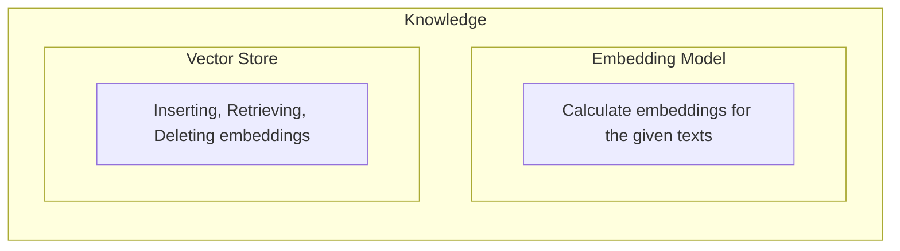

# Architecture

Ailoy is built on a modular architecture that separates AI inference, external
tools, and knowledge retrieval, yet seamlessly composes them through `Agent`.

At a high level, Ailoy consists of the following core components:

| Component   | Description                                                        |
| ----------- | ------------------------------------------------------------------ |
| `Agent`     | Orchestrates high-level agent behavior                             |
| `LangModel` | Serves as the reasoning and text generation engine                 |
| `Tool`      | Provides an extension interface for invoking external capabilities |
| `Knowledge` | Manages retrieval and augmentation with external information       |

## `Agent`

`Agent` is the top-level component. It is responsive to answer user's query, by
controlling execution of its sub-components.

- Generate text using the `LangModel`
- Invoke external functions through `Tool`
- Retrieve context from `Knowledge`

`Agent` exposes the `run()` function. It streams intermediate results or
reasoning traces back to the user.

## `LangModel`

The `LangModel` is the AI inference engine of Ailoy. It performs the actual
reasoning and text generation that power the agent’s intelligence. Given an
input sequence of messages, it interprets the context, predicts the next tokens,
and generates coherent responses.

Ailoy supports two types of models:

- API Models — cloud-based models
- Local Models — models that run entirely on your device

The `LangModel` defines how messages are tokenized, formatted, and executed. It
operates independently from the Agent, so you can use it directly when tools or
knowledge modules are not required.

## `Tool`

The Tool module enables the agent to perform operations beyond what `LangModel`
can do. It allows the model to interact with external systems, execute logic, or
query real-world data.

A tool consists of two main parts: **tool description** and **tool behavior**.

A **tool description** defines how the tool is exposed to the model. It includes
the tool’s name, description, parameters, and an optional return schema. This
format follows the JSON Schema convention.

A **tool behavior** defines what the tool actually does when invoked. It can be
implemented as a function in Python, JavaScript, or Rust. When the model outputs
a structured function call matching the tool’s schema, the Agent automatically
routes it to the corresponding behavior.

You can also use the Model Context Protocol (MCP) to register and expose tools
dynamically. This provides a seamless way to define, describe, and connect tool
behaviors across different environments.

## `Knowledge`

The Knowledge module enhances the agent’s reasoning ability by providing factual
or contextual data retrieved from external sources such as vector stores,
databases, or document collections.

When a query is made, the Knowledge module performs retrieval and returns an
array of documents relevant to the user’s input. These documents are then
integrated into the reasoning flow, allowing the model to produce more grounded
and accurate responses. This process is known as Retrieval-Augmented Generation
(RAG).

Knowledge combines two core components:

- `EmbeddingModel`: Converts texts into numerical embeddings that represent
  semantic meaning.
- `VectorStore`: Stores, searches, and manages embeddings for efficient
  similarity retrieval.

Together, these components allow the agent to search semantically similar
documents rather than relying on keyword matches, enabling more intelligent
context enrichment.

### Integration with `LangModel`

Ailoy allows the `Knowledge` module to be attached to a `LangModel` in two
integration modes:

#### 1. Native

In **native mode**, the `LangModel` itself is expected to support external
document input. The retrieved documents are directly attached to the model’s
input, allowing the model to internally process them as part of its reasoning.

However, many models currently do not support native document input formats. To
address this, Ailoy provides a **polyfill mechanism**. It is an internal
augmentation layer that modifies the model’s chat template so it can recognize
and interpret documents correctly. This polyfill enables RAG behavior even on
models lacking explicit document-handling capabilities.

#### 2. Tool

In **tool mode**, the `Knowledge` module is registered as a callable **tool**
(`knowledge` tool). When the `LangModel` determines that external context is
needed, it issues a function call to the `knowledge` tool. The tool executes the
retrieval process and returns relevant documents, which the agent then feeds
back into the reasoning flow.

This design allows the same retrieval process to be invoked dynamically through
the model’s reasoning, even for models that cannot handle direct document input.
