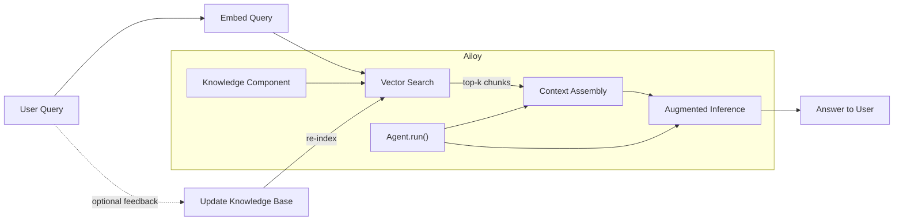

import AgentComponentsSvg from "./img/agent-components.svg";
import LangModelFlow from "./img/langmodel-flow.svg";
import ToolStructureSvg from "./img/tool-structure.svg";

# How Agent Works

<p align="center">
  <AgentComponentsSvg style={{ width: "60%", height: "60%" }} />
</p>

The Agent consists of a **language model** and various components (such as
**tools** and **knowledge** modules) that extend the model’s capabilities. Each
component communicates with one another through a unified format called
**message**.

## Input & Output Format: `Message`

Many language models are fine-tuned for chat-based interactions, enabling them
to engage in natural conversations with users. This conversational format
enables the model to interpret a user’s natural-language query and generate an
appropriate, context-aware response. This process is often referred to as **chat
completion**.

See the **[Chat Completion Format](./chat-completion-format)** for more
information.

## Language Model in a Nutshell

A **language model (LM)** is a type of AI system that can understand and
generate natural language. You can think of it as a highly advanced autocomplete
engine. It predicts what word or sentence should come next, based on the context
it has already seen. Trained on massive datasets, it can engage in conversation,
write code, summarize documents, and reason about complex problems. Yet, in a
way, it’s a simple system at its core.

To use Ailoy effectively, it helps to have a clear understanding of how a
language model works. In this section, we’ll briefly explain how an LM operates.

<p align="center">
  <LangModelFlow style={{ width: "100%", height: "100%" }} />
</p>

### Step 1: Applying the Chat Template

Before sending text into the model, Ailoy applies a chat template. This step
converts structured messages into a single plain-text sequence that the model
can process.

Different models have their own conversation formats. For example, the **ChatML
format** used by GPT models, the templated prompt looks like:

```
<|system|>
You are a helpful assistant.
<|endofturn|>
<|user|>
Write a haiku about AI.
<|endofturn|>
<|assistant|>
Sure!
AI dreams in code,
Learning patterns from the world —
Echoes of our minds.
<|endofturn|>
```

Likewise, other model families define their own templates. Ailoy automatically
applies the correct template depending on which model you use.

### Step 2: Tokenization

Language models operate on tokens — numerical representations of text. A token
might be a word, a subword, or even a single character, depending on the model’s
vocabulary.

Each token is mapped to a numeric ID to form a sequence the model can process.

For example:

```
Text: "The sky is blue today."
Tokens (string): ["The", " sky", " is", " blue", "today", "."]
Tokens (IDs): [172,  10400,  8172,  404, 629, 100]
```

These numeric IDs are what the model actually “sees” during inference.

### Step 3: Inference

Once tokenized, the model predicts the next token. It estimates a probability
distribution over all possible next tokens. In simple terms, it answers the
question:

> “Given what I’ve seen so far, what is the most likely next token?”

For example, if the result looks like:

| Candidate Token | Probability |
| --------------- | ----------- |
| "blue"          | 0.92        |
| "green"         | 0.03        |
| "red"           | 0.01        |
| ...             | ...         |

The model then samples one token based on these probabilities.

:::info

You can control this behavior using parameters such as `temperature` and
`top_p`.

Lower values make the output **more deterministic** (the model is more likely to
choose the highest-probability token), while higher values introduce **more
randomness and creativity** (the model may select lower-probability
alternatives).

:::

### Step 4: Detokenization

After predicting token IDs, the model converts them back into human-readable
text. This process, called detokenization, maps token IDs back to their
corresponding strings and joins them together into words and sentences.

### Step 5: Iterative Generation

After generating a token, the model appends it to the input sequence and repeats
the same process again. It re-encodes the new sequence, computes attention,
predicts the next token, and continues this loop.

For example:

- Input: "The sky is" → Model predicts "blue"
- New input: "The sky is blue" → Model predicts "today"
- New input: "The sky is blue today" → Model predicts "." (period)

Finally, it emits a stop token and terminates the generation process.

This iterative process continues until the model decides the text is complete or
reaches a set limit. The result is a coherent and contextually consistent piece
of text.

### Step 6: Accumulation

In Ailoy, the raw outputs from the model are emitted or streamed in a delta
format — representing incremental updates as tokens are generated. Ailoy
provides an accumulation API that reconstructs a complete message from these
deltas and produces the final `Message` object.

For more details on how to use this process, refer to the
**[delta](./chat-completion-format#delta)** section.

## Tool Call

In most agent systems, a tool call follows the process below.

<p align="center">
  <ToolStructureSvg style={{ width: "40%", height: "40%" }} />
</p>

1. **\[Tool Description\]** Assistant (or LLM) can recognize a tool based on its
   description.
2. **\[User Query\]** User provides an input prompt to the assistant.
3. **\[Tool Call\]** If that query is related to a tool, assistant can invoke
   the tool through a specified format.
4. **\[Tool Result\]** Tool performs its task as invoked and returns the result.
5. **\[Assistant Response\]** The assistant incorporates the tool’s output to
   generate a more accurate response.

## RAG (Retrieval-Augmented Generation)

While a language model alone can reason, generate, and converse, its knowledge
is limited to what was available at the time of training. Retrieval-Augmented
Generation (RAG) extends the model’s capabilities by grounding its responses in
external information sources — for example, documents, databases, or vector
stores.

The core idea of RAG is to retrieve the most relevant context before the model
generates an answer. This ensures that the model’s responses are both accurate
and up-to-date, even without retraining.

Here’s the general workflow:



1. **\[User Query\]** The user provides a natural-language question or
   instruction. e.g. “Summarize yesterday’s meeting notes” or “What are the
   risks mentioned in the quarterly report?”
2. **\[Embed Query & Vector Search\]** The system converts the query into a
   vector embedding—a numerical representation capturing its semantic meaning.
   It then searches a vector database (such as Faiss, Chroma, or Milvus) for the
   most semantically similar documents or passages.
3. **\[Context Assembly\]** The retrieved chunks of information are wrapped as
   Document objects.
4. **\[Augmented Inference\]** The language model receives both the user’s query
   and the retrieved context. It integrates the retrieved information into its
   reasoning chain and produces a grounded, factual response.
