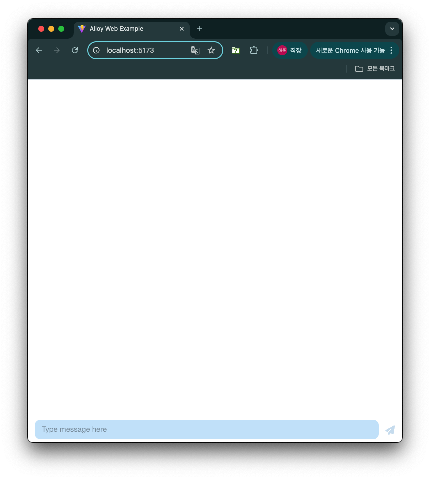
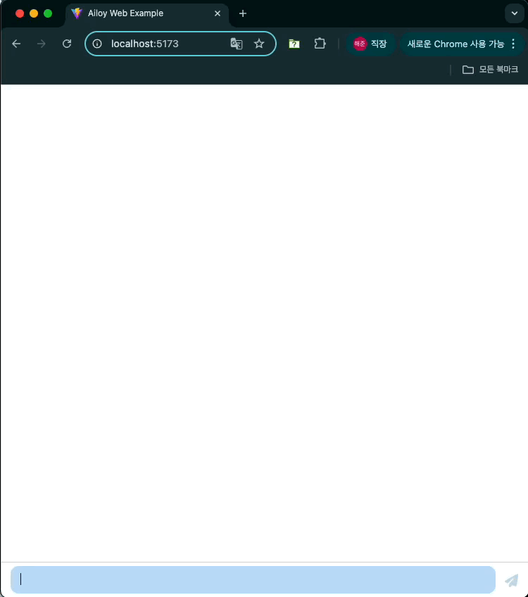
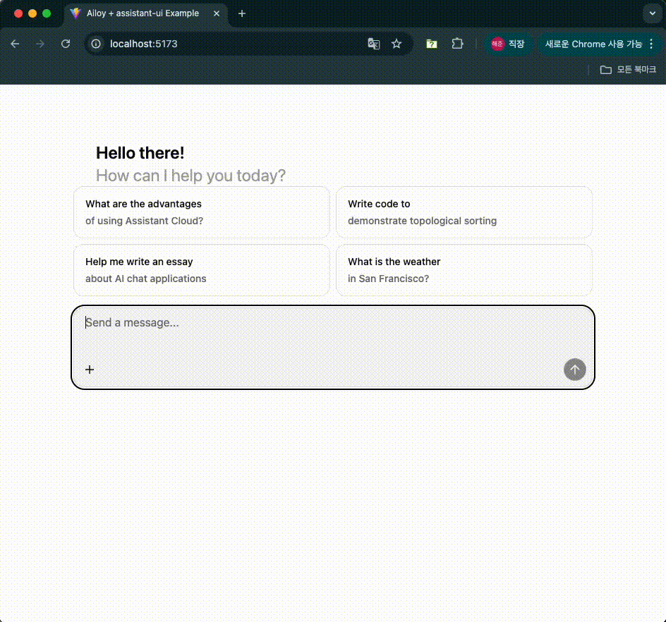

# WebAssembly Supports

{/* prettier-ignore-start */}

:::warning
WebAssembly support is currently **experimental**, and you may encounter unexpected errors.
If you do, please report them via our **GitHub Issues** or **Discord** channels so we can address them promptly.
:::

{/* prettier-ignore-end */}

Ailoy provides **WebAssembly (WASM)** support for running in modern web
browsers, with the following key capabilities:

- Run local models accelerated by **WebGPU** (both for Agents and VectorStores)
- Use API models exactly as in non-browser environments
- Access built-in tools or register your own custom tools
- Integrate **MCP tools** over Streamable HTTP, Server-Sent Events (SSE), or
  WebSocket transports

This guide will walk you through setting up and using `ailoy-web` in your web
applications.

## Hardware Requirements

If you plan to run local models in the browser using WebGPU, make sure your
system has the necessary hardware acceleration and drivers installed.

- **MacOS with Apple Silicon**: Fully supported, should work out-of-the-box.
  running this example.
- **Windows or Linux with NVIDIA/AMD GPUs**: Ensure that the latest GPU drivers
  are installed.

You can quickly check for WebGPU support in your browser by opening the
developer console and running:

```javascript
if (navigator.gpu) {
  // WebGPU is supported
  console.log("WebGPU is available!");
} else {
  // WebGPU is not supported
  console.log("WebGPU is not available.");
}
```

## Building a Simple Chat UI

### Setup Vite and install `ailoy-web`

We recommend using **[Vite](https://vite.dev/)** for a fast development
environment and optimized builds. This tutorial uses **React + TypeScript**
configuration.

{/* prettier-ignore-start */}

<TerminalBox>

$ npm create vite@latest

\> npx
\> create-vite

│
◇  Project name:
│  my-project
│
◇  Select a framework:
│  React
│
◇  Select a variant:
│  TypeScript
│
◇  Scaffolding project in /path/of/my-project...
│
└  Done. Now run:

  cd my-project
  npm install
  npm run dev

</TerminalBox>

{/* prettier-ignore-end */}

Next, navigate to your new project and install `ailoy-web`. This will also
install packages preconfigured in `package.json`.

{/* prettier-ignore-start */}

<TerminalBox>

$ cd my-project
$ npm install ailoy-web

added 265 packages, and audited 266 packages in 4s

64 packages are looking for funding
  run `npm fund` for details

found 0 vulnerabilities

</TerminalBox>

{/* prettier-ignore-end */}

To ensure optimal performance and compatibility, update your `vite.config.ts`
with the following settings:

- Exclude `ailoy-web` from dependency optimization (`optimizeDeps.exclude`)
- Enable cross-origin isolation (required for `SharedArrayBuffer` in WASM
  threading)
- Optimize bundle size by grouping `ailoy-web` into its own build chunk

```typescript
import react from "@vitejs/plugin-react";
import { defineConfig } from "vite";

export default defineConfig({
  plugins: [react()],
  optimizeDeps: {
    exclude: ["ailoy-web"],
  },
  server: {
    headers: {
      "Cross-Origin-Embedder-Policy": "require-corp",
      "Cross-Origin-Opener-Policy": "same-origin",
    },
  },
  build: {
    rollupOptions: {
      output: {
        manualChunks: {
          ailoy: ["ailoy-web"],
        },
      },
    },
  },
});
```

### Install `assistant-ui`

For this quick demo, we'll use [**assistant-ui**](https://www.assistant-ui.com/)
package to create a basic chat interface.

assistant-ui uses [**shadcn**](https://ui.shadcn.com/docs/installation/vite), so
you need to set it up before installing assistant-ui. Follow the guide from
[shadcn's documentation](https://ui.shadcn.com/docs/installation/vite).

Edit `tsconfig.json`.

```json {11-16}
{
  "files": [],
  "references": [
    {
      "path": "./tsconfig.app.json"
    },
    {
      "path": "./tsconfig.node.json"
    }
  ],
  "compilerOptions": {
    "baseUrl": ".",
    "paths": {
      "@/*": ["./src/*"]
    }
  }
}
```

Edit `tsconfig.app.json`

```json {4-7}
{
  "compilerOptions": {
    // ...
    "baseUrl": ".",
    "paths": {
      "@/*": ["./src/*"]
    }
    // ...
  }
}
```

Install tailwind and update `vite.config.ts`.

<TerminalBox>

npm install --save-dev tailwindcss @tailwindcss/vite @types/node

</TerminalBox>

```typescript {1-2,8-13}
import path from "node:path";
import tailwindcss from "@tailwindcss/vite";
import react from "@vitejs/plugin-react";
import { defineConfig } from "vite";

// https://vite.dev/config/
export default defineConfig({
  plugins: [react(), tailwindcss()],
  resolve: {
    alias: {
      "@": path.resolve(__dirname, "./src"),
    },
  },
  // other configs
});
```

Update `src/index.css` to use tailwindcss.

```css
@import "tailwindcss";
```

Install assistant-ui and add thread component. Also install `framer-motion`
package which is required by assistant-ui's thread.

{/* prettier-ignore-start */}

<TerminalBox>

$ npx assistant-ui add thread
✔ You need to create a components.json file to add components. Proceed? … yes
✔ Which color would you like to use as the base color? › Neutral
✔ Writing components.json.
✔ Checking registry.
✔ Installing dependencies.
✔ Created 6 files:
  - src/components/assistant-ui/thread.tsx
  - src/components/assistant-ui/markdown-text.tsx
  - src/components/assistant-ui/tooltip-icon-button.tsx
  - src/components/assistant-ui/tool-fallback.tsx
  - src/components/ui/button.tsx
  - src/components/ui/tooltip.tsx

$ npm install framer-motion

</TerminalBox>

{/* prettier-ignore-end */}

Due to `"verbatimModuleSyntax": true` configuration, you need to fix
`src/components/assistant-ui/tool-fallback.tsx` to prevent compile error.

```typescript {1}
import type { ToolCallMessagePartComponent } from "@assistant-ui/react";
import { CheckIcon, ChevronDownIcon, ChevronUpIcon } from "lucide-react";

// ...
```

### Implementation

Add `src/AiloyRuntimeProvider.tsx` and write the code as follow:

```typescript
"use client";

import { useState, useEffect, type ReactNode } from "react";
import {
  AssistantRuntimeProvider,
  useExternalStoreRuntime,
  useExternalMessageConverter,
  type AppendMessage,
} from "@assistant-ui/react";
import * as ai from "ailoy-web";

export function AiloyRuntimeProvider({
  children,
}: Readonly<{ children: ReactNode }>) {
  const [agent, setAgent] = useState<ai.Agent | undefined>(undefined);
  const [agentInitialized, setAgentInitialized] = useState<boolean>(false);
  const [messages, setMessages] = useState<
    (ai.UserMessage | ai.AgentResponse)[]
  >([]);
  const [isAnswering, setIsAnswering] = useState<boolean>(false);

  useEffect(() => {
    (async () => {
      const runtime = await ai.startRuntime();
      const agent = await ai.defineAgent(
        runtime,
        ai.LocalModel({ id: "Qwen/Qwen3-0.6B" })
      );
      setAgent(agent);
      setAgentInitialized(true);
    })();
  }, []);

  const onNew = async (message: AppendMessage) => {
    if (agent === undefined || !agentInitialized)
      throw new Error("Agent is not initialized yet");

    if (message.content[0]?.type !== "text")
      throw new Error("Only text messages are supported");

    const input = message.content[0].text;
    const userMessage: ai.UserMessage = {
      role: "user",
      content: input,
    };
    setMessages((prev) => [...prev, userMessage]);
    setIsAnswering(true);

    for await (const resp of agent.query(input)) {
      if (resp.type === "output_text" || resp.type === "reasoning") {
        if (resp.isTypeSwitched) {
          setMessages((prev) => [...prev, resp]);
        } else {
          setMessages((prev) => {
            const last = prev[prev.length - 1];
            last.content += resp.content;
            return [...prev.slice(0, -1), last];
          });
        }
      } else {
        setMessages((prev) => [...prev, resp]);
      }
    }
    setIsAnswering(false);
  };

  const convertedMessages = useExternalMessageConverter({
    messages,
    callback: (message: ai.UserMessage | ai.AgentResponse) => {
      if (message.role === "user") {
        return {
          role: message.role,
          content: [{ type: "text", text: message.content as string }],
        };
      } else if (message.type === "output_text") {
        return {
          role: "assistant",
          content: [{ type: "text", text: message.content }],
        };
      } else if (message.type === "reasoning") {
        return {
          role: "assistant",
          content: [{ type: "reasoning", text: message.content }],
        };
      } else if (message.type === "tool_call") {
        return {
          role: "assistant",
          content: [
            {
              type: "tool-call",
              toolCallId: message.content.id!,
              toolName: message.content.function.name,
              args: message.content.function.arguments,
            },
          ],
        };
      } else if (message.type === "tool_call_result") {
        return {
          role: "tool",
          toolCallId: message.content.tool_call_id!,
          result: message.content.content[0].text,
        };
      } else {
        throw new Error(`Unknown message type: ${message.type}`);
      }
    },
    isRunning: isAnswering,
    joinStrategy: "concat-content",
  });

  const runtime = useExternalStoreRuntime({
    isLoading: !agentInitialized,
    isRunning: isAnswering,
    messages: convertedMessages,
    onNew,
  });

  return (
    <AssistantRuntimeProvider runtime={runtime}>
      {children}
    </AssistantRuntimeProvider>
  );
}
```

Update `src/App.tsx` to use this provider.

```typescript
import { Thread } from "@/components/assistant-ui/thread";
import { AiloyRuntimeProvider } from "./AiloyRuntimeProvider";

function App() {
  return (
    <AiloyRuntimeProvider>
      <Thread />
    </AiloyRuntimeProvider>
  );
}

export default App;
```

React’s `<StrictMode>` can cause components to mount twice during development.
To avoid double state updates, remove `<StrictMode>` from `src/main.tsx`:

<CodeTabs>

```typescript
import { createRoot } from "react-dom/client";
import "./index.css";
import App from "./App.tsx";

createRoot(document.getElementById("root")!).render(<App />);
```

</CodeTabs>

Now run the development server and go to http://localhost:5173.

{/* prettier-ignore-start */}

<TerminalBox>

$ npm run dev

  VITE v7.1.1  ready in 318 ms

  ➜  Local:   http://localhost:5173/
  ➜  Network: use --host to expose
  ➜  press h + enter to show help

</TerminalBox>

{/* prettier-ignore-end */}

You should see the page like below if there was no error.



When the agent initializes for the first time, model parameters are downloaded
from Ailoy’s file server. These files are stored in the browser’s
[**Origin Private File System(OPFS)**](https://developer.mozilla.org/en-US/docs/Web/API/File_System_API/Origin_private_file_system)
which is isolated per origin and managed internally by the browser.

Once initialization completes, you can start chatting with the agent.



🎉 **Congratulation!** Now you have an agent running on your browser, without
any backend servers required and can be exported statically and deployed
anywhere!

## Additional Features

### Using API models

You can easily switch to API models by changing the model configuration as
below.

```typescript
const agent = await ai.defineAgent(
  runtime,
  // ai.LocalModel({ id: "Qwen/Qwen3-0.6B" })
  ai.APIModel({
    id: "gpt-5-mini",
    apiKey: "<YOUR_OPENAI_API_KEY>",
  })
);
```

{/* prettier-ignore-start */}

You can use any API models listed in [**supported API models**](http://localhost:3000/ailoy/docs/concepts/agent#api-models).

:::warning
The above code is for test purpose. **You should never hardcode your API keys in your frontend codes!**
For example, consider making an input box to get API key from users and initialize agents using the key.
:::

{/* prettier-ignore-end */}

### Using Tools

You can use any tool presets as described in
[**Out-of-the-box tools**](./tools#out-of-the-box-tools). Let's add handling
tool call and tool result messages and see how it works.

After `agent` is defined, add `calculator` tool preset as below.

```typescript
await agent.addToolsFromPreset("calculator");
```

Update the code in `<MessageList>` as below to show the corresponding message
content for each message type.

```typescript
          <MessageList>
            {messages.map((message, idx) => {
              let content = "";
              if (message.role === "user") {
                content = (message as ai.UserMessage).content as string;
              } else if (
                message.type === "output_text" ||
                message.type === "reasoning"
              ) {
                content = (message as ai.AgentResponse).content as string;
              } else if (message.type === "tool_call") {
                content = `Tool Call: ${message.content.function.name} (${message.content.id})`;
                content += `\nArguments: ${JSON.stringify(
                  message.content.function.arguments
                )}`;
              } else if (message.type === "tool_call_result") {
                content = `Tool Result (${message.content.tool_call_id})`;
                content += `\nContent: ${message.content.content[0].text}`;
              }

              return (
                <Message
                  key={`message-${idx}`}
                  model={{
                    direction:
                      message.role === "user" ? "outgoing" : "incoming",
                    position: "normal",
                    sender: message.role,
                    message: content,
                  }}
                />
              );
            })}
          </MessageList>
```

Test the tool calling with the prompt that might invoke the calculator tool.



### Using MCP tools

You can register MCP clients and use their tools in agents via
[Streamable HTTP](https://modelcontextprotocol.io/specification/2025-03-26/basic/transports#streamable-http),
[Server-Sent Event](https://modelcontextprotocol.io/specification/2024-11-05/basic/transports#http-with-sse),
and WebSocket transports. Note that
[stdio](https://modelcontextprotocol.io/specification/2025-03-26/basic/transports#stdio)
transport is not supported in browsers because they cannot run a stdio process.

{/* prettier-ignore-start */}

:::warning
When connecting to MCP servers from browsers, make sure the server is configured
to use **CORS middleware** with allowing your origins and exposing required
headers such as `Mcp-Session-Id`. See
[the official documentation](https://github.com/modelcontextprotocol/typescript-sdk?tab=readme-ov-file#cors-configuration-for-browser-based-clients)
for more details.
:::

{/* prettier-ignore-end */}

Let's create a simple MCP server for testing MCP tools availability.

Install the following packages.

<TerminalBox>

$ npm install express cors zod @modelcontextprotocol/sdk $ npm install
--save-dev @types/express @types/cors

</TerminalBox>

Create `src/mcpServer.ts` and write the code as below:

```typescript
import { McpServer } from "@modelcontextprotocol/sdk/server/mcp.js";
import { StreamableHTTPServerTransport } from "@modelcontextprotocol/sdk/server/streamableHttp.js";
import cors from "cors";
import express, { type Request, type Response } from "express";
import { z } from "zod";

// Create an MCP server
const server = new McpServer({
  name: "demo-server",
  version: "1.0.0",
});

// Add an addition tool
server.registerTool(
  "add",
  {
    title: "Addition Tool",
    description: "Add two numbers",
    inputSchema: { a: z.number(), b: z.number() },
  },
  async ({ a, b }) => ({
    content: [{ type: "text", text: String(a + b) }],
  })
);

const app = express();
app.use(express.json());
app.use(
  cors({
    origin: "*",
    exposedHeaders: "*",
  })
);

app.post("/mcp", async (req: Request, res: Response) => {
  try {
    const transport = new StreamableHTTPServerTransport({
      sessionIdGenerator: undefined,
    });
    res.on("close", () => {
      transport.close();
      server.close();
    });
    await server.connect(transport);
    await transport.handleRequest(req, res, req.body);
  } catch (error) {
    if (!res.headersSent) {
      res.status(500).json({
        jsonrpc: "2.0",
        error: {
          code: -32603,
          message: "Internal server error",
        },
        id: null,
      });
    }
  }
});

const PORT = 3000;
app.listen(PORT, () => {
  console.log(`MCP server listening on ${PORT}`);
});
```

This MCP server runs on streamable HTTP transport and has a single tool `add`
which takes two numbers and return the addition. The server runs on
`localhost:3000` and uses CORS middleware to allow any origins.

Install `vite-node` and add a script in `package.json` to run this server using
`vite-node`.

<TerminalBox>

$ npm install --save-dev vite-node

</TerminalBox>

```json {3}
  "scripts": {
    // ...
    "dev:mcp": "vite-node src/mcpServer.ts"
  }
```

Run the MCP server.

{/* prettier-ignore-start */}

<TerminalBox>

$ npm run dev:mcp

\> my-project@0.0.0 dev:mcp
\> vite-node src/mcpServer.ts

MCP server listening on 3000

</TerminalBox>

{/* prettier-ignore-end */}

In `src/AiloyRuntimeProvider.tsx`, add MCP tools after the agent has been
initialized.

```typescript {3-8}
const agent = ...;

await agent.addToolsFromMcpClient(
  "calculator",
  new ai.MCPStreamableHTTPClientTransport(
    new URL("http://localhost:3000/mcp")
  )
);
```

Check if MCP tools work as expected.

TODO: add MCP result image

## Using Vector Stores

TBD
