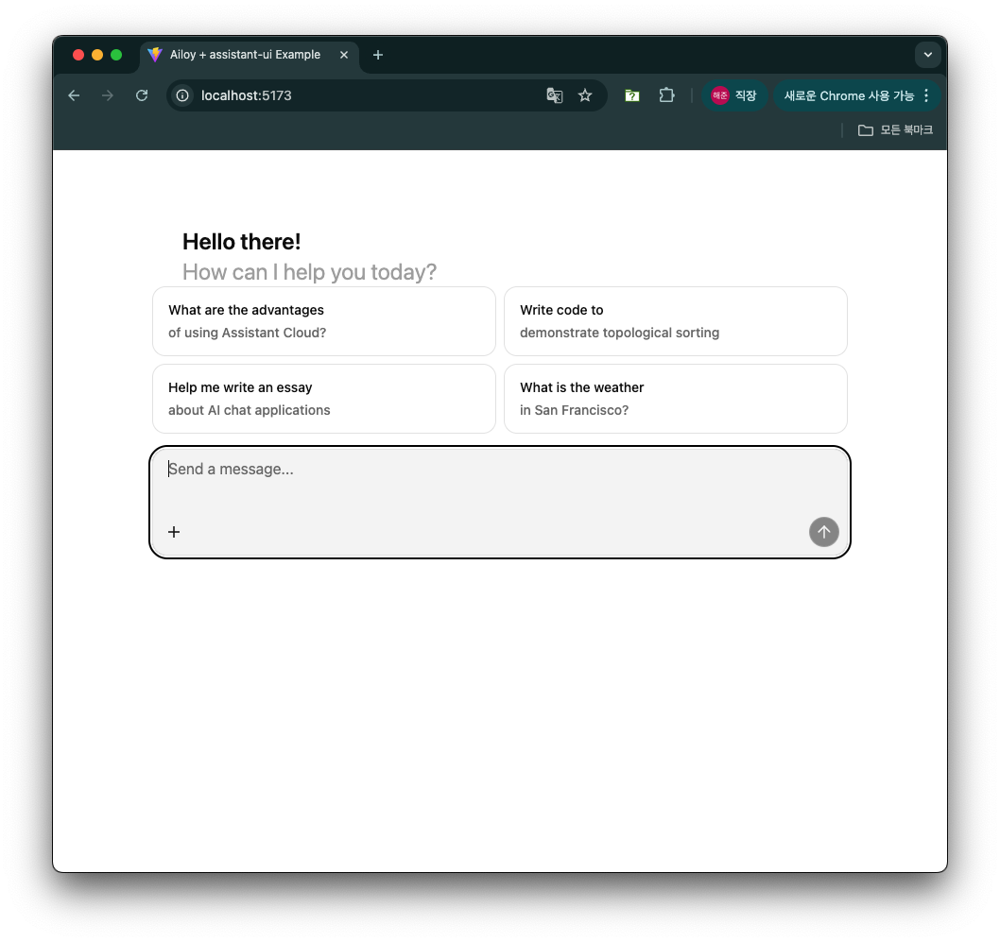

# WebAssembly Supports

{/* prettier-ignore-start */}

:::warning
WebAssembly support is currently **experimental**, and you may encounter unexpected errors.
If you do, please report them via our **GitHub Issues** or **Discord** channels so we can address them promptly.
:::

{/* prettier-ignore-end */}

Ailoy provides **WebAssembly (WASM)** support for running in modern web
browsers, with the following key capabilities:

- Run local models accelerated by **WebGPU** (both for Agents and VectorStores)
- Use API models exactly as in non-browser environments
- Access built-in tools or register your own custom tools
- Integrate **MCP tools** over Streamable HTTP, Server-Sent Events (SSE), or
  WebSocket transports (_Note: stdio is not supported in browsers because they
  cannot host a stdio server_)

This guide will walk you through setting up and using `ailoy-web` in your web
applications.

## Hardware Requirements

If you plan to run local models in the browser using WebGPU, make sure your
system has the necessary hardware acceleration and drivers installed.

- **MacOS with Apple Silicon**: Fully supported, should work out-of-the-box.
  running this example.
- **Windows or Linux with NVIDIA/AMD GPUs**: Ensure that the latest GPU drivers
  are installed.

You can quickly check for WebGPU support in your browser by opening the
developer console and running:

```javascript
if (navigator.gpu) {
  // WebGPU is supported
  console.log("WebGPU is available!");
} else {
  // WebGPU is not supported
  console.log("WebGPU is not available.");
}
```

## Setting Up Your Project

We recommend using **[Vite](https://vite.dev/)** for a fast development
environment and optimized builds. This tutorial will use **React + TypeScript**,
but you can adapt it to your preferred framework.

{/* prettier-ignore-start */}

<TerminalBox>

$ npm create vite@latest

\> npx
\> create-vite

│
◇  Project name:
│  my-project
│
◇  Select a framework:
│  React
│
◇  Select a variant:
│  TypeScript
│
◇  Scaffolding project in /path/of/my-project...
│
└  Done. Now run:

  cd my-project
  npm install
  npm run dev

</TerminalBox>

{/* prettier-ignore-end */}

Next, navigate to your new project and install `ailoy-web`. This package
includes all required dependencies configured in `package.json`.

{/* prettier-ignore-start */}

<TerminalBox>

$ cd my-project 
$ npm install ailoy-web

added 265 packages, and audited 266 packages in 4s

64 packages are looking for funding
  run `npm fund` for details

found 0 vulnerabilities

</TerminalBox>

{/* prettier-ignore-end */}

### Configuring Vite for `ailoy-web`

To ensure optimal performance and compatibility, update your `vite.config.ts`
with the following settings:

- Exclude `ailoy-web` from dependency optimization (`optimizeDeps.exclude`)
- Enable cross-origin isolation (required for `SharedArrayBuffer` in WASM
  threading)
- Optimize bundle size by grouping `ailoy-web` into its own build chunk

```typescript
import react from "@vitejs/plugin-react";
import { defineConfig } from "vite";

export default defineConfig({
  plugins: [react()],
  optimizeDeps: {
    exclude: ["ailoy-web"],
  },
  server: {
    headers: {
      "Cross-Origin-Embedder-Policy": "require-corp",
      "Cross-Origin-Opener-Policy": "same-origin",
    },
  },
  build: {
    rollupOptions: {
      output: {
        manualChunks: {
          ailoy: ["ailoy-web"],
        },
      },
    },
  },
});
```

## Example: Building a Simple Chat UI

For this quick demo, we'll use
[@chatscope/chat-ui-kit-react](https://github.com/chatscope/chat-ui-kit-react)
package to create a basic chat interface.

<TerminalBox>

$ npm install @chatscope/chat-ui-kit-react

</TerminalBox>

Update `src/App.tsx` with the following code:

<CodeTabs>

```typescript
import { useState, useEffect } from "react";
import "@chatscope/chat-ui-kit-styles/dist/default/styles.min.css";
import {
  MainContainer,
  ChatContainer,
  MessageList,
  Message,
  MessageInput,
} from "@chatscope/chat-ui-kit-react";
import * as ai from "ailoy-web";

function App() {
  const [runtime, setRuntime] = useState<ai.Runtime | undefined>(undefined);
  const [agent, setAgent] = useState<ai.Agent | undefined>(undefined);
  const [agentInitialized, setAgentInitialized] = useState<boolean>(false);
  const [messages, setMessages] = useState<
    (ai.UserMessage | ai.AgentResponse)[]
  >([]);
  const [agentAnswering, setAgentAnswering] = useState<boolean>(false);

  useEffect(() => {
    (async () => {
      const runtime = await ai.startRuntime();
      setRuntime(runtime);

      const agent = await ai.defineAgent(
        runtime,
        ai.LocalModel({ id: "Qwen/Qwen3-0.6B" })
      );
      setAgent(agent);

      setAgentInitialized(true);
    })();

    return () => {
      agent?.delete();
      runtime?.stop();
    };
  }, []);

  const onSend = async (_: string, textContent: string) => {
    setMessages((msgs) => [...msgs, { role: "user", content: textContent }]);
    setAgentAnswering(true);

    for await (const resp of agent!.query(textContent, { reasoning: true })) {
      if (resp.type === "output_text" || resp.type === "reasoning") {
        if (resp.isTypeSwitched) {
          setMessages((msgs) => [...msgs, resp]);
        } else {
          setMessages((msgs) => {
            const last = msgs[msgs.length - 1];
            last.content += resp.content;
            return [...msgs.slice(0, -1), last];
          });
        }
      }
    }
    setAgentAnswering(false);
  };

  return (
    <div style={{ position: "relative", width: "100vw", height: "100vh" }}>
      <MainContainer>
        <ChatContainer>
          <MessageList>
            {messages.map((message, idx) => {
              return (
                <Message
                  key={`message-${idx}`}
                  model={{
                    direction:
                      message.role === "user" ? "outgoing" : "incoming",
                    position: "normal",
                    sender: message.role,
                    message: message.content as string,
                  }}
                />
              );
            })}
          </MessageList>
          <MessageInput
            placeholder="Type message here"
            attachButton={false}
            disabled={!agentInitialized || agentAnswering}
            onSend={onSend}
          />
        </ChatContainer>
      </MainContainer>
    </div>
  );
}

export default App;
```

</CodeTabs>

React’s `<StrictMode>` can cause components to mount twice during development.
To avoid unintended side effects, remove `<StrictMode>` from `src/main.tsx`:

<CodeTabs>

```typescript
import { createRoot } from "react-dom/client";
import "./index.css";
import App from "./App.tsx";

createRoot(document.getElementById("root")!).render(<App />);
```

</CodeTabs>

Start the development server:

{/* prettier-ignore-start */}

<TerminalBox>

$ npm run dev

  VITE v7.1.1  ready in 318 ms

  ➜  Local:   http://localhost:5173/
  ➜  Network: use --host to expose
  ➜  press h + enter to show help

</TerminalBox>

{/* prettier-ignore-end */}

Open `http://localhost:5173` in your browser.



When the agent initializes for the first time, model parameters are downloaded
from Ailoy’s file server. These files are stored in the browser’s
[**Origin Private File System(OPFS)**](https://developer.mozilla.org/en-US/docs/Web/API/File_System_API/Origin_private_file_system)
which is isolated per origin and managed internally by the browser.

Once initialization completes, you can start chatting with the model.


## Using API models

TBD

## Using MCP tools

TBD

## Using Vector Stores

TBD
