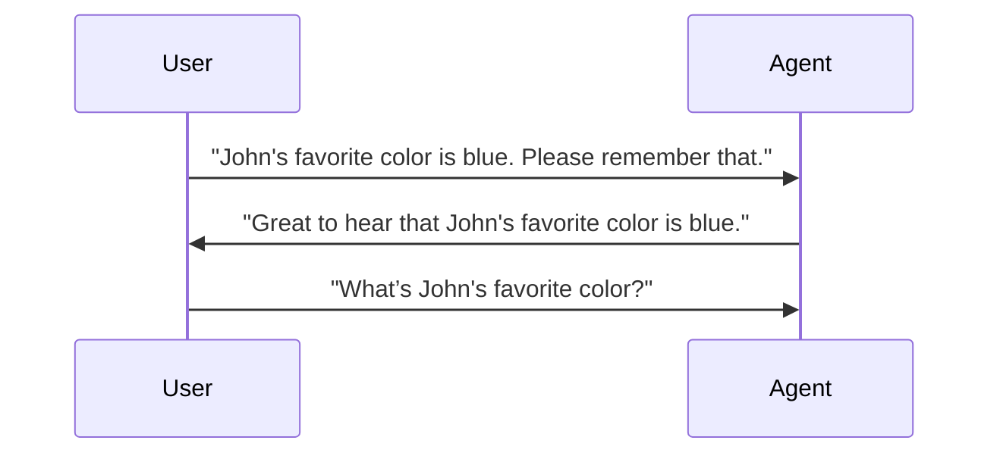

# Multi-Turn Conversation

Ailoy's `Agent` is stateless by design. It does not keep track of conversation
history. Each time you invoke the agent, it treats the provided messages as a
fresh request with no internal memory of past conversations.

If you want to run an agent with previous context, you must explicitly **include
the entire conversation history** (all prior messages) when making the call.

## Adding Context to the Conversation

Let's say that the user and the agent have exchanged some messages, as shown in
the following diagram.



You would expect the agent to answer `blue`, considering the context.

To add context to the conversation, you need to pass _both_ the **previous
messages** and **your new user message**.

{/* prettier-ignore-start */}

<CodeTabs>

```python
import asyncio

import ailoy as ai


async def main():
    lm = await ai.LangModel.new_local("Qwen/Qwen3-0.6B")
    agent = ai.Agent(lm)

    messages = [
        # the previous messages
        ai.Message(role="user", contents="John's favorite color is blue. Please remember that."),
        ai.Message(role="assistant", contents="Great to hear that John's favorite color is blue."),
        # your new user message
        ai.Message(role="user", contents="What’s John's favorite color?"),
    ]
    async for resp in agent.run(messages):
        if isinstance(resp.message.contents[0], ai.Part.Text):
            print(resp.message.contents[0].text)

if __name__ == "__main__":
    asyncio.run(main())
```

```typescript
import * as ai from "ailoy-node";

async function main() {
  const model = await ai.LangModel.newLocal("Qwen/Qwen3-0.6B");
  const agent = new ai.Agent(model);

  const messages = [
    // the previous messages
    { role: "user", contents: "John's favorite color is blue. Please remember that." },
    { role: "assistant", contents: "Great to hear that John's favorite color is blue." },
    // your new user message
    { role: "user", contents: "What’s John's favorite color?" },
  ];
  for await (const resp of agent.run(messages)) {
    if (resp.message.contents?.[0]?.type === "text")
      console.log(resp.message.contents?.[0]?.text);
  }
}

main().catch((err) => {
  console.error("Error:", err);
});
```

```typescript web
import * as ai from "ailoy-web";

async function main() {
  const model = await ai.LangModel.newLocal("Qwen/Qwen3-0.6B");
  const agent = new ai.Agent(model);

  const messages = [
    // the previous messages
    { role: "user", contents: "John's favorite color is blue. Please remember that." },
    { role: "assistant", contents: "Great to hear that John's favorite color is blue." },
    // your new user message
    { role: "user", contents: "What’s John's favorite color?" },
  ];
  for await (const resp of agent.run(messages)) {
    if (resp.message.contents?.[0]?.type === "text")
      console.log(resp.message.contents?.[0]?.text);
  }
}

main().catch((err) => {
  console.error("Error:", err);
});
```

</CodeTabs>

{/* prettier-ignore-end */}

By including the full history, Ailoy can generate a coherent response while
remaining internally stateless — it never stores conversation data between runs.

## A Live Multi-Turn Conversations

You can implement a live chat for the user and the agent by collecting real-time
messages and passing them back to the agent.

{/* prettier-ignore-start */}

<CodeTabs>

```python
import asyncio

import ailoy as ai


async def main():
    lm = await ai.LangModel.new_local("Qwen/Qwen3-0.6B")
    agent = ai.Agent(lm)

    print("(Enter 'exit' to end the conversation.)")
    messages = []
    while (user_message := input("User: ").strip()).lower() != "exit":
        messages.append(ai.Message(role="user", contents=user_message))
        async for resp in agent.run(messages):
            if isinstance(resp.message.contents[0], ai.Part.Text):
                print("Agent:", resp.message.contents[0].text)
            messages.append(resp.message)
    print("Agent: It was a nice conversation!")


if __name__ == "__main__":
    asyncio.run(main())
```

```typescript
import * as ai from "ailoy-node";
import * as readline from "readline";

async function main() {
  const model = await ai.LangModel.newLocal("Qwen/Qwen3-0.6B");
  const agent = new ai.Agent(model);
  const rl = readline.createInterface({
    input: process.stdin,
    output: process.stdout,
  });

  const question = (msg: string) =>
    new Promise<string>((res) => rl.question(msg, res));
  let messages: ai.Messages = [];

  console.log("(Enter 'exit' to end the conversation.)");

  while (true) {
    const input = (await question("User: ")).trim();
    if (input.toLowerCase() === "exit") break;

    messages.push({ role: "user", contents: input });

    for await (const resp of agent.run(messages as ai.Messages)) {
      if (resp.message.contents?.[0]?.type === "text")
        console.log("Agent:", resp.message.contents?.[0]?.text);
      messages.push(resp.message);
    }
  }

  console.log("Agent: It was a nice conversation!");
  rl.close();
}

main().catch((err) => {
  console.error("Error:", err);
});
```

</CodeTabs>

:::info
Example code for web environments is not provided here.  
To see a conversational agent that continuously interacts with the user, check out the **[WebAssembly Supports](webassembly-supports)** page.
:::

{/* prettier-ignore-end */}
