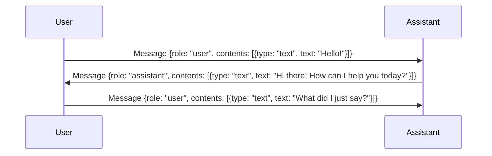

# Multi-Turn Conversation

Ailoy's `Agent` is designed to be stateless. It does not keep track of
conversation histories. Each time you call the model, agent treats it as a new
request. Each time you invoke the agent, it treats the provided messages as a
fresh request with no internal memory of past conversations.

If you want you run an assistant with previous context, you must explicitly
**include the entire conversation history** (all prior messages) when making the
call.



<CodeTabs>

```python
import asyncio

import ailoy as ai


async def main():
    lm = await ai.LangModel.new_local("Qwen/Qwen3-0.6B")
    agent = ai.Agent(lm)

    messages = [
        # the previous messages
        ai.Message(role="user", contents="Hello!"),
        ai.Message(role="assistant", contents="Hi there! How can I help you today?"),
        # your new user message
        ai.Message(role="user", contents="What did I just say?"),
    ]
    async for resp in agent.run(messages):
        if isinstance(resp.message.contents[0], ai.Part.Text):
            print(resp.message.contents[0].text)

if __name__ == "__main__":
    asyncio.run(main())
```

```typescript
import * as ai from "ailoy-node";

async function main() {
  const model = await ai.LangModel.newLocal("Qwen/Qwen3-0.6B");
  const agent = new ai.Agent(model);

  const messages = [
    // the previous messages
    { role: "user", contents: "Hello!" },
    { role: "assistant", contents: "Hi there! How can I help you today?" },
    // your new user message
    { role: "user", contents: "What did I just say?" },
  ];
  for await (const resp of agent.run(messages)) {
    console.log(resp.message.contents[0].text);
  }
}

main().catch((err) => {
  console.error("Error:", err);
});
```

```typescript web
import * as ai from "ailoy-web";

async function main() {
  const model = await ai.LangModel.newLocal("Qwen/Qwen3-0.6B");
  const agent = new ai.Agent(model);

  const messages = [
    // the previous messages
    { role: "user", contents: "Hello!" },
    { role: "assistant", contents: "Hi there! How can I help you today?" },
    // your new user message
    { role: "user", contents: "What did I just say?" },
  ];
  for await (const resp of agent.run(messages)) {
    console.log(resp.message.contents[0].text);
  }
}

main().catch((err) => {
  console.error("Error:", err);
});
```

</CodeTabs>

By including the full history, Ailoy can generate a coherent response while
remaining internally stateless — it never stores conversation data between runs.

## Interactive Multi-Turn conversations

If you want to simulate a live chat where the user and assistant exchange
messages interactively, you can accumulate the message history in a list and
feed it back each turn.

<CodeTabs>

```python
import asyncio

import ailoy as ai


async def main():
    lm = await ai.LangModel.new_local("Qwen/Qwen3-0.6B")
    agent = ai.Agent(lm)

    print("(Enter 'exit' to end the conversation.)")
    messages = []
    while (user_message := input("User: ")).lower() != "exit":
        messages.append(ai.Message(role="user", contents=user_message))
        async for resp in agent.run(messages):
            if isinstance(resp.message.contents[0], ai.Part.Text):
                print("Assistant:", resp.message.contents[0].text)
            messages.append(resp.message)
    print("Assistant: It was a nice conversation!")


if __name__ == "__main__":
    asyncio.run(main())
```

```typescript
import * as ai from "ailoy-node";
import * as readline from "readline";

async function main() {
  const model = await ai.LangModel.newLocal("Qwen/Qwen3-0.6B");
  const agent = new ai.Agent(model);
  const rl = readline.createInterface({
    input: process.stdin,
    output: process.stdout,
  });

  const question = (msg: string) =>
    new Promise<string>((res) => rl.question(msg, res));
  let messages: ai.Messages = [];

  console.log("(Enter 'exit' to end the conversation.)");

  while (true) {
    const input = (await question("User: ")).trim();
    if (input.toLowerCase() === "exit") break;

    messages.push({ role: "user", contents: input });

    for await (const resp of agent.run(messages as ai.Messages)) {
      if (resp.message.contents[0].type === "text")
        console.log("Assistant:", resp.message.contents[0].text);
      messages.push(resp.message);
    }
  }

  console.log("Assistant: It was a nice conversation!");
  rl.close();
}

main().catch((err) => {
  console.error("Error:", err);
});
```

</CodeTabs>

:::info

To see a conversational agent that continuously interacts with users, check out
**[WebAssembly Supports](webassembly-supports)** page.

:::
