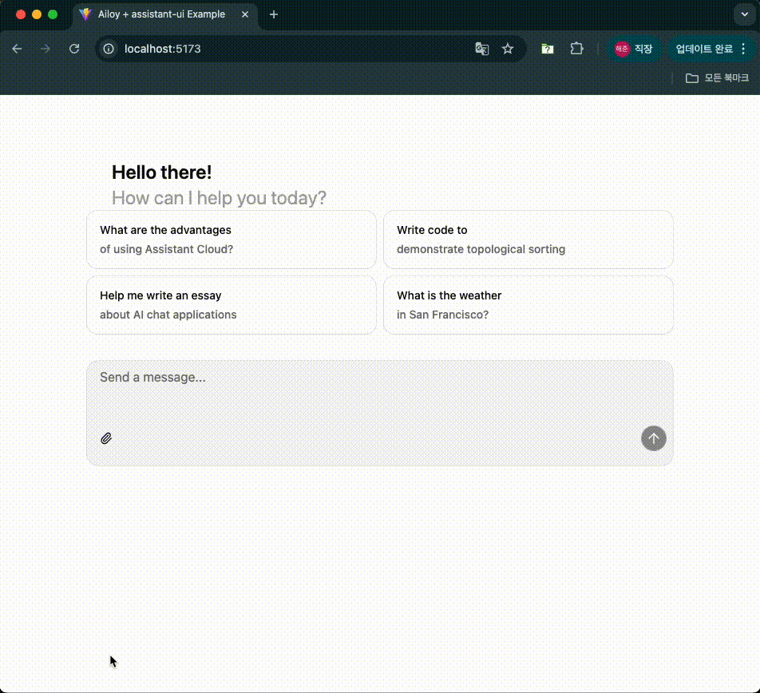

# WebAssembly Supports

:::warning

WebAssembly support is currently **experimental**, and you may encounter
unexpected errors. If you do, please report them via our
[**GitHub Issues**](https://github.com/brekkylab/ailoy/issues) or
[**Discord**](https://discord.gg/27rx3EJy3P) channel so we can address them
promptly.

:::

Ailoy supports running agents entirely in modern web browsers using
**WebAssembly (WASM)**. This enables AI workloads directly in the browser with
no backend required.

**Key capabilities**

- Run local models accelerated by **WebGPU**—supports both **LangModel**s and
  **EmbeddingModel**s.
- Use API models just like you would in native environments.
- Register your own **custom tools** or **MCP tools** (via Streamable HTTP
  transport) on agents.
- Use **vector stores** to construct a RAG pipeline.

This guide walks you through setting up and using `ailoy-web` in your
browser-based applications.

## Hardware Requirements

If you plan to run local models with WebGPU, make sure your system has the
necessary hardware accelerators and drivers installed. See
[**Supported Environments**](../resources/supported-environments.mdx) for more
details.

- **MacOS with Apple Silicon**: Fully supported, typically works out of the box.
- **Windows / Linux with NVIDIA or AMD GPUs**: Ensure that the latest GPU
  drivers are installed.

In addition, WebGPU must support certain features—such as `shader-f16`. You can
quickly verify your setup using the `isWebGPUSupported` utility:

```javascript
import { isWebGPUSupported } from "ailoy-web";

const { supported, reason } = await isWebGPUSupported();
if (supported) {
  // WebGPU is supported
  console.log("✅ WebGPU is available!");
} else {
  // WebGPU is not supported
  console.log(
    "❌ WebGPU is not available due to the following reason: ",
    reason
  );
}
```

:::info

If WebGPU is not supported, consider showing users a clear message in your UI
that explains why—using the `reason` value returned by the function.

:::

## Building a Simple Chat UI

In this tutorial, we're going to build a simple chat UI application using Ailoy.
You can see the full example codes in
[our repository](https://github.com/brekkylab/ailoy/tree/main/examples/web-assistant-ui).

### Setup Vite and install `ailoy-web`

We recommend using **[Vite](https://vite.dev/)** for a fast development
environment and optimized builds. Still you can use another build tools you
prefer, such as Webpack, Rollup, or Parcel.

In this example, we use Vite to create a project with **React + TypeScript**
configuration.

1. Let's create a Vite project by running `npm create vite@latest`.

{/* prettier-ignore-start */}

<TerminalBox>

$ npm create vite@latest

\> npx
\> create-vite

│
◇  Project name:
│  my-project
│
◇  Select a framework:
│  React
│
◇  Select a variant:
│  TypeScript
│
◇  Scaffolding project in /path/of/my-project...
│
└  Done. Now run:

  cd my-project
  npm install
  npm run dev

</TerminalBox>

{/* prettier-ignore-end */}

2. Next, navigate to your new project and install `ailoy-web`. This will also
   install packages preconfigured in `package.json`.

{/* prettier-ignore-start */}

<TerminalBox>

$ cd my-project
$ npm install ailoy-web

added 265 packages, and audited 266 packages in 4s

64 packages are looking for funding
  run `npm fund` for details

found 0 vulnerabilities

</TerminalBox>

{/* prettier-ignore-end */}

3. To ensure optimal performance and compatibility, update your `vite.config.ts`
   with the following settings:
   - Exclude `ailoy-web` from dependency optimization (`optimizeDeps.exclude`)
   - Enable cross-origin isolation (required for `SharedArrayBuffer` in WASM
     threading)
   - Optimize bundle size by grouping `ailoy-web` into its own build chunk

```typescript
import react from "@vitejs/plugin-react";
import { defineConfig } from "vite";

export default defineConfig({
  plugins: [react()],
  optimizeDeps: {
    exclude: ["ailoy-web"],
  },
  server: {
    headers: {
      "Cross-Origin-Embedder-Policy": "require-corp",
      "Cross-Origin-Opener-Policy": "same-origin",
    },
  },
  build: {
    rollupOptions: {
      output: {
        manualChunks: {
          ailoy: ["ailoy-web"],
        },
      },
    },
  },
});
```

### Install and configure `assistant-ui`

For this quick demo, we'll use [**assistant-ui**](https://www.assistant-ui.com/)
package to create a basic chat interface.

It relies on [**shadcn**](https://ui.shadcn.com/docs/installation/vite), so
we'll set that up first. Follow the guide from
[shadcn's documentation](https://ui.shadcn.com/docs/installation/vite).

1. Edit `tsconfig.json`.

```json {11-16}
{
  "files": [],
  "references": [
    {
      "path": "./tsconfig.app.json"
    },
    {
      "path": "./tsconfig.node.json"
    }
  ],
  "compilerOptions": {
    "baseUrl": ".",
    "paths": {
      "@/*": ["./src/*"]
    }
  }
}
```

2. Edit `tsconfig.app.json`

```json {4-7}
{
  "compilerOptions": {
    // ...
    "baseUrl": ".",
    "paths": {
      "@/*": ["./src/*"]
    }
    // ...
  }
}
```

3. Install `tailwind` and update `vite.config.ts`.

<TerminalBox>

$ npm install --save-dev tailwindcss @tailwindcss/vite @types/node

added 22 packages, and audited 215 packages in 3s

51 packages are looking for funding run `npm fund` for details

found 0 vulnerabilities

</TerminalBox>

```typescript {1-2,8-13}
import path from "node:path";
import tailwindcss from "@tailwindcss/vite";
import react from "@vitejs/plugin-react";
import { defineConfig } from "vite";

// https://vite.dev/config/
export default defineConfig({
  plugins: [react(), tailwindcss()],
  resolve: {
    alias: {
      "@": path.resolve(__dirname, "./src"),
    },
  },
  // other configs
});
```

4. Update `src/index.css` to use tailwindcss.

```css
@import "tailwindcss";
```

5. Install `assistant-ui` and add thread component.  
   `npx assistant-ui add thread`

{/* prettier-ignore-start */}

<TerminalBox>

$ npx assistant-ui add thread
✔ You need to create a components.json file to add components. Proceed? … yes
✔ Which color would you like to use as the base color? › Neutral
✔ Writing components.json.
✔ Checking registry.
✔ Installing dependencies.
✔ Created 6 files:
  - src/components/assistant-ui/thread.tsx
  - src/components/assistant-ui/markdown-text.tsx
  - src/components/assistant-ui/tooltip-icon-button.tsx
  - src/components/assistant-ui/tool-fallback.tsx
  - src/components/ui/button.tsx
  - src/components/ui/tooltip.tsx

</TerminalBox>

{/* prettier-ignore-end */}

6. Install `framer-motion` package which is required by `assistant-ui`'s
   thread.  
   `npm install framer-motion`

{/* prettier-ignore-start */}

<TerminalBox>

$ npm install framer-motion

up to date, audited 374 packages in 696ms

141 packages are looking for funding
  run `npm fund` for details

found 0 vulnerabilities

</TerminalBox>

{/* prettier-ignore-end */}

7. Due to `"verbatimModuleSyntax": true` configuration, you need to fix
   `src/components/assistant-ui/tool-fallback.tsx` to prevent compile error.

```typescript {1}
import type { ToolCallMessagePartComponent } from "@assistant-ui/react";
import { CheckIcon, ChevronDownIcon, ChevronUpIcon } from "lucide-react";

// ...
```

### Implementation

We use assistant-ui's
[ExternalStoreRuntime](https://www.assistant-ui.com/docs/runtimes/custom/external-store)
feature to ingest messages converted from states where raw messages are stored
in Ailoy format.

1. Let's start from writing conversion logics from Ailoy's `Message` and
   `MessageDelta` to assistant-ui's `useExternalMessageConverter.Message`.  
   Create `src/AiloyRuntimeProvider.tsx` and write the code as follow:

```typescript
import { useExternalMessageConverter } from "@assistant-ui/react";
import * as ai from "ailoy-web";

function imageDataToBase64(arr: Uint8Array): string {
  let binaryString = "";
  arr.forEach((byte) => {
    binaryString += String.fromCharCode(byte);
  });
  const base64String = btoa(binaryString);
  return base64String;
}

function convertMessage(
  message: ai.Message
): useExternalMessageConverter.Message {
  if (message.role === "user") {
    return {
      role: message.role,
      content: message.contents.map((part) => {
        if (part.type === "text") return part;
        else if (part.type === "image") {
          if (part.image.type === "binary") {
            return {
              type: "image",
              image: `data:image/png;base64,${imageDataToBase64(
                part.image.data
              )}`,
            };
          } else {
            return { type: "image", image: part.image.url };
          }
        } else if (part.type === "value")
          return { type: "text", text: part.value!.toString() };
        else throw Error("Unknown content type");
      }),
    };
  } else if (message.role === "assistant") {
    let contents = [];
    if (message.thinking) {
      contents.push({
        type: "reasoning",
        text: message.thinking,
      });
    }
    if (message.tool_calls) {
      for (const toolCall of message.tool_calls) {
        if (toolCall.type !== "function")
          throw new Error("tool call content should be a type of function");
        contents.push({
          type: "tool-call",
          toolCallId: toolCall.id,
          toolName: toolCall.function.name,
          args: toolCall.function.arguments,
        });
      }
    }
    for (const content of message.contents) {
      if (content.type === "text") {
        contents.push(content);
      }
    }
    return {
      role: message.role,
      content: contents,
    } as useExternalMessageConverter.Message;
  } else if (message.role === "tool") {
    let toolResult: string;
    if (message.contents[0].type === "text") {
      toolResult = message.contents[0].text;
    } else if (message.contents[0].type === "value") {
      toolResult = JSON.stringify(message.contents[0].value);
    } else {
      throw new Error("Tool result should be either text or value.");
    }
    return {
      role: "tool",
      toolCallId: message.id,
      result: toolResult,
    } as useExternalMessageConverter.Message;
  } else {
    throw new Error(`Unknown message type: ${message}`);
  }
}

function convertMessageDelta(
  delta: ai.MessageDelta
): useExternalMessageConverter.Message {
  if (delta.role === "assistant") {
    let contents = [];
    if (delta.thinking !== undefined) {
      contents.push({
        type: "reasoning",
        text: delta.thinking,
      });
    }
    if (delta.tool_calls.length > 0) {
      for (const toolCall of delta.tool_calls) {
        if (toolCall.type !== "function")
          throw new Error("tool call content should be a type of function");
        if (toolCall.function.type === "verbatim") {
          contents.push({ type: "text", text: toolCall.function.text });
        } else if (toolCall.function.type === "with_string_args") {
          contents.push({
            type: "text",
            text: `{"name": "${toolCall.function.name}", "arguments": ${toolCall.function.arguments}}`,
          });
        } else {
          contents.push({
            type: "text",
            text: `{"name": "${toolCall.function.name}", "arguments": ${toolCall.function.arguments}}`,
          });
        }
      }
    }
    for (const content of delta.contents) {
      if (content.type === "text") {
        contents.push(content);
      }
    }
    return {
      role: "assistant",
      content: contents,
    } as useExternalMessageConverter.Message;
  } else if (delta.role === "tool") {
    let toolResult: string;
    if (delta.contents[0].type === "text") {
      toolResult = delta.contents[0].text;
    } else if (delta.contents[0].type === "value") {
      toolResult = JSON.stringify(delta.contents[0].value);
    } else {
      throw new Error("Tool result should be either text or value.");
    }
    return {
      role: "tool",
      toolCallId: delta.id,
      result: toolResult,
    } as useExternalMessageConverter.Message;
  } else {
    // Consider this case as an empty assistant message
    return {
      role: "assistant",
      content: [],
    };
  }
}
```

2. Write `AiloyRuntimeProvider` component as follow:

```typescript
"use client";

import { useState, useEffect, useMemo, type ReactNode } from "react";
import {
  AssistantRuntimeProvider,
  useExternalStoreRuntime,
  useExternalMessageConverter,
  type AppendMessage,
} from "@assistant-ui/react";
import * as ai from "ailoy-web";

/// Conversion logics

export function AiloyRuntimeProvider({
  children,
}: Readonly<{ children: ReactNode }>) {
  const [agent, setAgent] = useState<ai.Agent | undefined>(undefined);
  const [agentLoading, setAgentLoading] = useState<boolean>(false);
  // This stores the complete messages
  const [messages, setMessages] = useState<ai.Message[]>([]);
  // This stores the ongoing accumulated message delta
  const [ongoingMessage, setOngoingMessage] = useState<ai.MessageDelta | null>(
    null
  );
  const [isAnswering, setIsAnswering] = useState<boolean>(false);

  useEffect(() => {
    (async () => {
      // Check if WebGPU is available first
      const { supported, reason } = await ai.isWebGPUSupported();
      if (!supported) {
        alert(`WebGPU is not supported: ${reason!}`);
        return;
      }

      setAgentLoading(true);

      // Initialize the agent with local LangModel
      const agent = new ai.Agent(
        await ai.LangModel.newLocal("Qwen/Qwen3-0.6B")
      );
      setAgent(agent);

      setAgentLoading(false);
    })();
  }, []);

  const onNew = async (message: AppendMessage) => {
    if (agent === undefined) throw new Error("Agent is not initialized yet");

    // Add text content
    if (message.content[0]?.type !== "text")
      throw new Error("Only text messages are supported");

    // Append a new user message
    const newMessage: ai.Message = {
      role: "user",
      contents: [{ type: "text", text: message.content[0].text }],
    };
    setMessages((prev) => [...prev, newMessage]);

    setIsAnswering(true);
    let accumulated: ai.MessageDelta | null = null;
    for await (const { delta, finish_reason } of agent.runDelta([
      ...messages,
      newMessage,
    ])) {
      // Store accumulated message delta
      accumulated =
        accumulated === null
          ? delta
          : ai.accumulateMessageDelta(accumulated, delta);
      setOngoingMessage(accumulated);

      // Finish the delta and append to messages on `finish_reason` arrived
      if (finish_reason !== undefined) {
        let newMessage = ai.finishMessageDelta(accumulated);
        setMessages((prevMessages) => [...prevMessages, newMessage]);
        setOngoingMessage(null);
        accumulated = null;
      }
    }
    setIsAnswering(false);
  };

  // Converted messages derived from raw messages and message delta
  const convertedMessages: useExternalMessageConverter.Message[] =
    useMemo(() => {
      let converted = messages.map(convertMessage);
      if (ongoingMessage !== null) {
        let convertedDelta = convertMessageDelta(ongoingMessage);
        converted = [...converted, convertedDelta];
      }
      return converted;
    }, [messages, ongoingMessage]);

  // Create ExternalStoreRuntime
  const runtime = useExternalStoreRuntime({
    isLoading: agentLoading,
    isDisabled: agent === undefined,
    isRunning: isAnswering,
    messages: useExternalMessageConverter({
      messages: convertedMessages,
      callback: (msg) => msg,
      isRunning: isAnswering,
    }),
    onNew,
  });

  return (
    <AssistantRuntimeProvider runtime={runtime}>
      {children}
    </AssistantRuntimeProvider>
  );
}
```

3. Update `src/App.tsx` to wrap `<Thread />` inside `<AiloyRuntimeProvider>`.

```typescript
import { Thread } from "@/components/assistant-ui/thread";
import { AiloyRuntimeProvider } from "./AiloyRuntimeProvider";

function App() {
  return (
    <AiloyRuntimeProvider>
      <Thread />
    </AiloyRuntimeProvider>
  );
}

export default App;
```

4. React’s `<StrictMode>` can cause components to mount twice during
   development.  
   To avoid double state updates, remove `<StrictMode>` from `src/main.tsx`:

```typescript
// import { StrictMode } from 'react'
import { createRoot } from 'react-dom/client'
import './index.css'
import App from './App.tsx'

createRoot(document.getElementById('root')!).render(
  // <StrictMode>
    <App />
  // </StrictMode>,
)
```

5. Start the development server with `npm run dev`.

{/* prettier-ignore-start */}

<TerminalBox>

$ npm run dev

  VITE v7.1.1  ready in 318 ms

  ➜  Local:   http://localhost:5173/
  ➜  Network: use --host to expose
  ➜  press h + enter to show help

</TerminalBox>

{/* prettier-ignore-end */}

6. Visit http://localhost:5173 — your chat UI should be live.


{/* prettier-ignore-start */}

:::info
When the agent initializes for the first time, model parameters are downloaded
from Ailoy’s file server. These files are stored in the browser’s
[**Origin Private File System(OPFS)**](https://developer.mozilla.org/en-US/docs/Web/API/File_System_API/Origin_private_file_system)
which is isolated per origin and managed internally by the browser.

Once initialization completes, you can start chatting with the agent.
:::

{/* prettier-ignore-end */}

6. Try to start a conversation with the agent running _on your web browser_.


🎉 **Congratulations!** You now have a fully local AI agent running **entirely
in your browser** with zero backend servers!

## Additional Features

### Using API models

You can easily switch to API models by changing the model configuration as
below.

```typescript
const agent = new ai.Agent(
  // await ai.LangModel.newLocal("Qwen/Qwen3-0.6B")
  await ai.LangModel.newStreamAPI(
    "OpenAI",
    "gpt-5-mini",
    "<YOUR_OPENAI_API_KEY>"
  )
);
```

You can use any API models listed in
[**Available Models**](../resources/available-models.mdx).

:::warning

The above code is for test purpose. **You should never hardcode your API keys in
your frontend codes!** For example, consider making an input box to get API key
from users and initialize agents using the key.

:::

### Multi-Modal Inputs

:::info

Image inputs are currently supported only on API models as described in
[**Image Inputs**](./image-inputs.mdx).

:::

Follow the guide in assistant-ui's
[**Attachments documentation**](https://www.assistant-ui.com/docs/guides/Attachments)
to enable file attachment functionality.

Install attachment UI component.

<TerminalBox>

$ npx shadcn@latest add "https://r.assistant-ui.com/attachment"

</TerminalBox>

Similar to what we did for Thread component, edit
`src/components/assistant-ui/attachment.tsx` as below to fix compile error.

{/* prettier-ignore-start */}

```typescript {1}
import { type PropsWithChildren, useEffect, useState, type FC } from "react";
import { CircleXIcon, FileIcon, PaperclipIcon } from "lucide-react";
```

{/* prettier-ignore-end */}

Edit `src/components/assistant-ui/thread.tsx` to add attachment components.

```typescript {1-5,15-17,29-31,44}
import {
  ComposerAttachments,
  ComposerAddAttachment,
  UserMessageAttachments,
} from "./attachment";

// Update Composer
const Composer: FC = () => {
  return (
    <div ...>
      <ThreadScrollToBottom />
      <ThreadPrimitive.Empty>
        <ThreadWelcomeSuggestions />
      </ThreadPrimitive.Empty>
      <ThreadPrimitive.Empty>
        <ComposerAttachments />
      </ThreadPrimitive.Empty>
      <ComposerPrimitive.Root ...>
        // ...
      </ComposerPrimitive.Root>
    </div>
  )
}

// Update ComposerAction
const ComposerAction: FC = () => {
  return (
    <div ...>
      <ThreadPrimitive.If running={false}>
        <ComposerAddAttachment />
      </ThreadPrimitive.If>
      // ...
    </div>
  )
}

// Update UserMessage
const UserMessage: FC = () => {
  return (
    <MessagePrivitive.Root asChild>
      <motion.div
        // ...
      >
        <UserMessageAttachments />
        <UserActionBar />
        // ...
      </motion.div>
    </MessagePrivitive.Root>
  )
}
```

In `src/AiloyRuntimeProvider.tsx`, update `onNew` to handle image contents.

```typescript {4-30}
const onNew = async (message: AppendMessage) => {
  if (agent === undefined) throw new Error("Agent is not initialized yet");

  let userContents: ai.Part[] = [];

  // Add attachments
  if (message.attachments !== undefined) {
    for (const attach of message.attachments) {
      // Add image content
      if (attach.type === "image") {
        const ab = await attach.file!.arrayBuffer();
        const arr = new Uint8Array(ab);
        const imagePart = ai.imageFromBytes(arr);
        userContents.push(imagePart);
      }
      // other types are skipped
    }
  }

  // Add text content
  if (message.content[0]?.type !== "text")
    throw new Error("Only text messages are supported");
  userContents.push({ type: "text", text: message.content[0].text });

  // Append a new user message
  const newMessage: ai.Message = {
    role: "user",
    contents: userContents,
  };
  setMessages((prev) => [...prev, newMessage]);

  // ...
```

Add `adapters` on `useExternalStoreRuntime` to handle image file attachments.

```typescript {1-5,9-14}
import {
  CompositeAttachmentAdapter,
  SimpleImageAttachmentAdapter,
  SimpleTextAttachmentAdapter,
} from "@assistant-ui/react";

const runtime = useExternalStoreRuntime({
  // ...
  adapters: {
    attachments: new CompositeAttachmentAdapter([
      new SimpleImageAttachmentAdapter(),
      new SimpleTextAttachmentAdapter(),
    ]),
  },
});
```

You don't need to modify the message conversion logics further, since it already
handles image type contents.

Now you can attach images and ask about them.


### Reasoning

Follow the guide in assistant-ui's
[**Reasoning documentation**](https://www.assistant-ui.com/docs/ui/Reasoning) to
enable reasoning UI.

Install reasoning UI component.

<TerminalBox>

$ npx assistant-ui@latest add reasoning

</TerminalBox>

Pass the `Reasoning` and `ReasoningGroup` components to the
`MessagePrimitive.Parts` component in `src/components/assistant-ui/thread.tsx`:

```typescript {1,11-12}
import {Reasoning, ReasoningGroup} from "./reasoning";

const AssistantMessage: FC = () => {
  return (
    <MessagePrimitive.Root asChild>
      // ...
      <div className="...">
        <MessagePrimitive.Parts
          components={{
            // ...
            Reasoning,
            ReasoningGroup,
          }}
        />
      </div>
      // ...
    </MessagePrimitive.Root>
  )
}
```

Now you can see how reasoning is visualized by adding agent config as follow:

```typescript {3-7}
for await (const { delta, finish_reason } of agent.runDelta(
  [...messages, newMessage],
  {
    inference: {
      thinkEffort: "enable",
    },
  }
)) {
  // ...
}
```


### Using Tools

You can register tools to agents with the same APIs as described in
[**Using Tools**](./using-tools.mdx). Let's add a simple tool and see how the
tool calls and results are handled.

Define `calculator-add` tool and register to agent as below.

```typescript
const agent = ...;

const tool = ai.Tool.newFunction(
  {
    name: "calculator-add",
    description: "Get two numbers and return the addition.",
    parameters: {
      type: "object",
      properties: {
        a: {
          type: "integer",
          description: "The first number",
        },
        b: {
          type: "integer",
          description: "The second number",
        },
      },
    },
  },
  async (args: { a: number; b: number }) => {
    return args.a + args.b;
  }
);
agent.addTool(tool);
```

Test the tool calling with the prompt that might invoke the `calculator-add`
tool.



### Using MCP Tools

You can initialize MCP clients and use their tools in agents via
[Streamable HTTP](https://modelcontextprotocol.io/specification/2025-03-26/basic/transports#streamable-http)
transport. Note that
[stdio](https://modelcontextprotocol.io/specification/2025-03-26/basic/transports#stdio)
transport is not supported in browsers because they cannot run a stdio process.

:::warning

When connecting to MCP servers from browsers, make sure the server is configured
to use **CORS middleware** with allowing your origins and exposing required
headers such as `Mcp-Session-Id`. See
[the official documentation](https://github.com/modelcontextprotocol/typescript-sdk?tab=readme-ov-file#cors-configuration-for-browser-based-clients)
for more details.

:::

Let's create a simple MCP server for testing MCP tools availability.

Install the following packages.

{/* prettier-ignore-start */}

<TerminalBox>

$ npm install express cors zod @modelcontextprotocol/sdk 
$ npm install --save-dev @types/express @types/cors

</TerminalBox>

{/* prettier-ignore-end */}

Create `src/mcpServer.ts` and write the code as below:

```typescript
import { McpServer } from "@modelcontextprotocol/sdk/server/mcp.js";
import { StreamableHTTPServerTransport } from "@modelcontextprotocol/sdk/server/streamableHttp.js";
import cors from "cors";
import express, { type Request, type Response } from "express";
import * as z from "zod/v3";

// Create an MCP server
const server = new McpServer({
  name: "demo-server",
  version: "1.0.0",
});

// Add an addition tool
server.registerTool(
  "add",
  {
    title: "Addition Tool",
    description: "Add two numbers",
    inputSchema: { a: z.number(), b: z.number() },
  },
  async ({ a, b }) => ({
    content: [{ type: "text", text: String(a + b) }],
  })
);

const app = express();
app.use(express.json());
app.use(
  cors({
    origin: "*",
    exposedHeaders: "*",
  })
);

app.post("/mcp", async (req: Request, res: Response) => {
  try {
    const transport = new StreamableHTTPServerTransport({
      sessionIdGenerator: undefined,
    });
    res.on("close", () => {
      transport.close();
      server.close();
    });
    await server.connect(transport);
    await transport.handleRequest(req, res, req.body);
  } catch (error) {
    if (!res.headersSent) {
      res.status(500).json({
        jsonrpc: "2.0",
        error: {
          code: -32603,
          message: "Internal server error",
        },
        id: null,
      });
    }
  }
});

const PORT = 3000;
app.listen(PORT, () => {
  console.log(`MCP server listening on ${PORT}`);
});
```

:::warning

Note that we used `zod/v3` since the current latest version of MCP sdk does not
work with zod v4.
([related issue](https://github.com/modelcontextprotocol/modelcontextprotocol/issues/1072))

:::

This MCP server runs on streamable HTTP transport and has a single tool `add`
which takes two numbers and return the addition. The server runs on
`localhost:3000` and uses CORS middleware to allow any origins.

Install `vite-node` and add a script in `package.json` to run this server using
`vite-node`.

<TerminalBox>

$ npm install --save-dev vite-node

</TerminalBox>

```json {3}
  "scripts": {
    // ...
    "dev:mcp": "vite-node src/mcpServer.ts"
  }
```

Run the MCP server.

{/* prettier-ignore-start */}

<TerminalBox>

$ npm run dev:mcp

\> my-project@0.0.0 dev:mcp
\> vite-node src/mcpServer.ts

MCP server listening on 3000

</TerminalBox>

{/* prettier-ignore-end */}

In `src/AiloyRuntimeProvider.tsx`, add MCP tools after the agent has been
initialized.

```typescript {3-4}
const agent = ...;

const mcpClient = await ai.MCPClient.streamableHttp("http://localhost:3000/mcp");
agent.addTools(mcpClient.tools);
```

Check if MCP tools work as expected.


## Using Vector Stores

You can interact with Vector Stores in Ailoy Web using the same APIs described
in [**RAG Using Documents**](./rag-using-documents.mdx).

When combined with **local embedding models** and **in-memory vector stores**
such as **Faiss**, you can build a fully client-side RAG application that runs
entirely inside the user's browser—no backend servers required. This approach is
ideal for privacy-preserving, offline-capable AI assistants.

### Creating an EmbeddingModel

```typescript
import * as ai from "ailoy-web";

const em = await ai.EmbeddingModel.newLocal("BAAI/bge-m3");
```

### Creating a VectorStore

```typescript
import * as ai from "ailoy-web";

// Using an in-memory Faiss vectorstore
const vectorstore = await ai.VectorStore.newFaiss(1024);

// Using an external ChromaDB server
const vectorstore = await ai.VectorStore.newChroma(
  "http://localhost:8000", // Replace with your ChromaDB endpoint
  "my-collection",  // Your target collection name
);
```

:::warning

When using external vector stores such as ChromaDB, make sure they're configured
to use **CORS middleware** to allow your origin. For ChromaDB, refer the
[**CORS configuration**](https://cookbook.chromadb.dev/strategies/cors/).

:::

### Inserting Documents

Before you can retrieve documents, you must insert them into the vector store
along with optional metadata.

Typically, you'll chunk your text into smaller pieces before insertion for
better retrieval accuracy.

```typescript
const items = [
  {
    document:
      "BGE M3 is an embedding model supporting dense retrieval, lexical matching and multi-vector interaction.",
    metadata: { topic: "bge-m3" },
  },
  {
    document:
      "BM25 is a bag-of-words retrieval function that ranks a set of documents based on the query terms appearing in each document",
    metadata: { topic: "bm25" },
  },
];

for (const item of items) {
  const embedding = await em.infer(item.document);
  const result = await vectorstore.addVector({ embedding, ...item });
  console.log(result); // Example: "1"
}
```

### Retrieving Documents

You can retrieve the most relevant documents by similarity score, which is
computed using vector embeddings.

```typescript
const queryEmbedding = await em.infer("What is BGE-M3?");
// Retrieve the top 1 item most similar to the query
const retrievedItems = await vectorstore.retrieve(queryEmbedding, 1);
console.log(retrievedItems);
// Expected: returns the document related to "bge-m3"
```

### Clearing the Vector Store

If you need to reset or remove all entries from the vector store:

```typescript
await vectorstore.clear();
```
