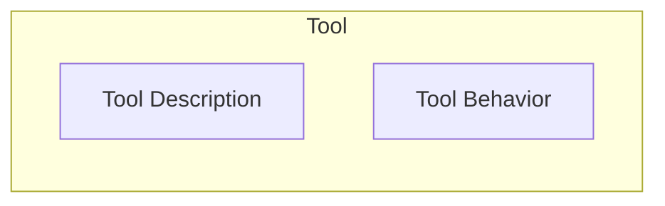
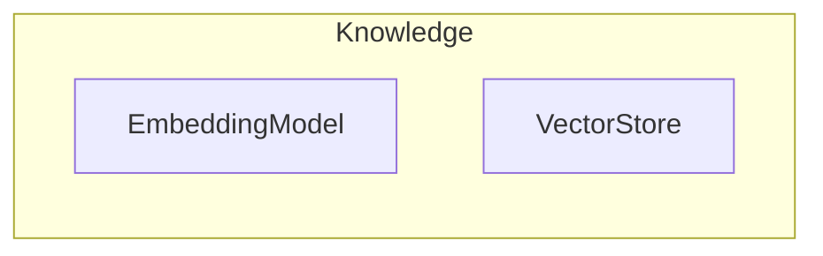

# 아키텍처

Ailoy는 AI 추론, 외부 Tool, 지식 검색을 분리하면서도 `Agent`를 통해 원활하게
구성하는 모듈식 아키텍처를 기반으로 합니다.

높은 수준에서 Ailoy는 다음과 같은 핵심 컴포넌트로 구성됩니다:

| 컴포넌트    | 설명                                                   |
| ----------- | ------------------------------------------------------ |
| `Agent`     | 상위 수준 에이전트 동작을 조율합니다                   |
| `LangModel` | 추론 및 텍스트 생성 엔진 역할을 합니다                 |
| `Tool`      | 외부 기능을 호출하기 위한 확장 인터페이스를 제공합니다 |
| `Knowledge` | 외부 정보를 활용한 검색 및 증강을 관리합니다           |

## `Agent`

`Agent`는 최상위 컴포넌트입니다. 하위 컴포넌트의 실행을 제어하여 사용자의 쿼리에
응답합니다.

- `LangModel`을 사용하여 텍스트 생성
- `Tool`을 통해 외부 함수 호출
- `Knowledge`에서 컨텍스트 검색

`Agent`는 `run()` 함수를 노출합니다. 중간 결과나 추론 추적을 사용자에게
스트리밍합니다.

## `LangModel`

`LangModel`은 Ailoy의 AI 추론 엔진입니다. 에이전트의 지능을 구동하는 실제 추론
및 텍스트 생성을 수행합니다. 입력 메시지 시퀀스가 주어지면 컨텍스트를 해석하고,
다음 토큰을 예측하고, 일관된 응답을 생성합니다.

Ailoy는 두 가지 유형의 모델을 지원합니다:

- API 모델 — 클라우드 기반 모델
- 로컬 모델 — 기기에서 완전히 실행되는 모델

`LangModel`은 메시지가 토큰화, 포맷팅, 실행되는 방식을 정의합니다. Agent와
독립적으로 작동하므로 Tool나 지식 모듈이 필요하지 않을 때 직접 사용할 수
있습니다.

## `Tool`

Tool 모듈은 에이전트가 `LangModel`이 할 수 있는 것 이상의 작업을 수행할 수 있게
합니다. 모델이 외부 시스템과 상호작용하고, 로직을 실행하거나, 실제 데이터를
쿼리할 수 있게 합니다.

Tool은 **Tool Description**과 **Tool Behavior**이라는 두 가지 주요 부분으로
구성됩니다.



**Tool Description**은 Tool이 모델에 어떻게 노출되는지 정의합니다. Tool의 이름,
설명, 매개변수 및 선택적 반환 스키마를 포함합니다. 이 형식은 JSON Schema 규약을
따릅니다.

관례적으로 이것은 JSON Schema로 표현되며, 우리도 이를 따릅니다.

<details>
<summary>스키마 예시</summary>
<p>
```json
{
  "name": "temperature",
  "description": "Get current temperature",
  "parameters": {
    "type": "object",
    "properties": {
      "location": {
        "type": "string",
        "description": "The city name"
      },
      "unit": {
        "type": "string",
        "enum": ["Celsius", "Fahrenheit"]
      }
    },
    "required": ["location", "unit"]
  },
  "returns": {
    "type": "number",
    "description": "Null if the given city name is unavailable.",
    "nullable": true
  }
}
```
</p>
</details>

반면 **Tool Behavior**은 Tool이 호출될 때 실제로 수행하는 작업을 정의합니다.
예를 들어, Python, JavaScript 또는 Rust의 커스텀 함수일 수 있습니다. 모델이
Tool의 스키마와 일치하는 구조화된 함수 호출을 출력하면 Agent는 자동으로 해당
동작으로 라우팅합니다.

모델 컨텍스트 프로토콜(MCP)을 사용하여 Tool을 동적으로 등록하고 노출할 수도
있습니다. 이는 다양한 환경에서 Tool Behavior을 정의, 설명, 연결하는 원활한
방법을 제공합니다.

Ailoy는 3가지 유형의 Tool을 정의할 수 있습니다:

| 유형     | 설명                                                                   |
| -------- | ---------------------------------------------------------------------- |
| Function | 명시적 `ToolDesc`가 있는 호스트 언어의 네이티브 함수                   |
| MCP      | <strong>모델 컨텍스트 프로토콜(MCP)</strong>을 통해 노출되는 원격 Tool |
| Builtin  | **Ailoy** 런타임 자체에서 제공하는 미리 정의된 Tool                    |

## `Knowledge`

Knowledge 모듈은 벡터 스토어, 데이터베이스 또는 문서 컬렉션과 같은 외부 소스에서
검색된 사실적 또는 컨텍스트 데이터를 제공하여 에이전트의 추론 능력을
향상시킵니다.

쿼리가 수행되면 Knowledge 모듈은 검색을 수행하고 사용자 입력과 관련된 문서
배열을 반환합니다. 이러한 문서는 추론 흐름에 통합되어 모델이 더 근거 있고 정확한
응답을 생성할 수 있게 합니다. 이 과정을 검색 증강 생성(RAG)이라고 합니다.



Knowledge는 두 가지 핵심 컴포넌트를 결합합니다:

- `EmbeddingModel`: 텍스트를 시맨틱한 의미를 나타내는 숫자 임베딩으로
  변환합니다.
- `VectorStore`: 효율적인 유사도 검색을 위해 임베딩을 저장, 검색, 관리합니다.

이러한 컴포넌트를 함께 사용하면 에이전트가 키워드 일치에 의존하지 않고
의미적으로 유사한 문서를 검색할 수 있어 더 지능적인 컨텍스트 강화가 가능합니다.

### `LangModel`과의 통합

Ailoy는 `Knowledge` 모듈을 두 가지 통합 모드로 `LangModel`에 연결할 수 있습니다:

#### 1. 네이티브

**네이티브 모드**에서 `LangModel` 자체가 외부 문서 입력을 지원해야 합니다.
검색된 문서는 모델의 입력에 직접 첨부되어 모델이 추론의 일부로 내부적으로 처리할
수 있습니다.

그러나 현재 많은 모델이 네이티브 문서 입력 형식을 지원하지 않습니다. 이를
해결하기 위해 Ailoy는 **폴리필 메커니즘**을 제공합니다. 이는 모델의 채팅
템플릿을 수정하여 문서를 올바르게 인식하고 해석할 수 있도록 하는 내부 증강
레이어입니다. 이 폴리필은 명시적인 문서 처리 기능이 없는 모델에서도 RAG 동작을
가능하게 합니다.

#### 2. Tool

**Tool 모드**에서 `Knowledge` 모듈은 호출 가능한 **Tool**(`knowledge` Tool)로
등록됩니다. `LangModel`이 외부 컨텍스트가 필요하다고 판단하면 `knowledge` Tool에
함수 호출을 발행합니다. Tool은 검색 프로세스를 실행하고 관련 문서를 반환하며,
에이전트는 이를 추론 흐름에 다시 공급합니다.

이 설계를 통해 직접 문서 입력을 처리할 수 없는 모델에서도 모델의 추론을 통해
동적으로 동일한 검색 프로세스를 호출할 수 있습니다.
