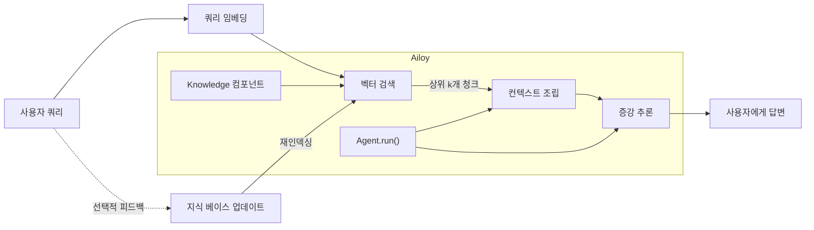

import AgentComponentsSvg from "@site/docs/concepts/img/agent-components.svg";
import LangModelFlow from "@site/docs/concepts/img/langmodel-flow.svg";
import ToolStructureSvg from "@site/docs/concepts/img/tool-structure.svg";

# 에이전트 작동 방식

<p align="center">
  <AgentComponentsSvg style={{ width: "60%", height: "60%" }} />
</p>

에이전트는 **언어 모델**과 모델의 기능을 확장하는 다양한 컴포넌트(**Tool** 및
**지식** 모듈 등)로 구성됩니다. 각 컴포넌트는 **메시지**라는 통일된 형식을 통해
서로 통신합니다.

## 입출력 형식: `Message`

많은 언어 모델은 채팅 기반 상호작용에 맞게 파인튜닝되어 사용자와 자연스러운
대화를 나눌 수 있습니다. 이 대화 형식을 통해 모델은 사용자의 자연어 쿼리를
해석하고 적절하고 컨텍스트를 인식하는 응답을 생성할 수 있습니다. 이 과정을 흔히

<strong>채팅 완성(chat completion)</strong>이라고 합니다.

자세한 내용은 [**채팅 완성 형식**](./chat-completion-format)을 참조하세요.

## 언어 모델 핵심 개념

<strong>언어 모델(LM)</strong>은 자연어를 이해하고 생성할 수 있는 AI 시스템의 한
유형입니다. 고도로 발전한 자동완성 엔진이라고 생각할 수 있습니다. 이미 본
컨텍스트를 기반으로 다음에 올 단어나 문장을 예측합니다. 방대한 데이터셋으로
학습되어 대화를 나누고, 코드를 작성하고, 문서를 요약하고, 복잡한 문제를 추론할
수 있습니다. 그러나 근본적으로는 단순한 시스템입니다.

Ailoy를 효과적으로 사용하려면 언어 모델이 어떻게 작동하는지 명확히 이해하는 것이
도움이 됩니다. 이 섹션에서는 LM의 작동 방식을 간략히 설명합니다.

<p align="center">
  <LangModelFlow style={{ width: "100%", height: "100%" }} />
</p>

### 1단계: 채팅 템플릿 적용

텍스트를 모델에 보내기 전에 Ailoy는 채팅 템플릿을 적용합니다. 이 단계는 구조화된
메시지를 모델이 처리할 수 있는 단일 일반 텍스트 시퀀스로 변환합니다.

모델마다 고유한 대화 형식이 있습니다. 예를 들어, GPT 모델이 사용하는 **ChatML
형식**에서 템플릿이 적용된 프롬프트는 다음과 같습니다:

```
<|system|>
You are a helpful assistant.
<|endofturn|>
<|user|>
Write a haiku about AI.
<|endofturn|>
<|assistant|>
Sure!
AI dreams in code,
Learning patterns from the world —
Echoes of our minds.
<|endofturn|>
```

마찬가지로 다른 모델 계열도 자체 템플릿을 정의합니다. Ailoy는 사용하는 모델에
따라 올바른 템플릿을 자동으로 적용합니다.

### 2단계: 토큰화

언어 모델은 토큰(텍스트의 숫자 표현)으로 작동합니다. 토큰은 모델의 어휘에 따라
단어, 하위 단어 또는 단일 문자가 될 수 있습니다.

각 토큰은 숫자 ID에 매핑되어 모델이 처리할 수 있는 시퀀스를 형성합니다.

예를 들어:

```
Text: "The sky is blue today."
Tokens (string): ["The", " sky", " is", " blue", "today", "."]
Tokens (IDs): [172,  10400,  8172,  404, 629, 100]
```

이러한 숫자 ID가 추론 중에 모델이 실제로 "보는" 것입니다.

### 3단계: 추론

토큰화되면 모델은 다음 토큰을 예측합니다. 가능한 모든 다음 토큰에 대한 확률
분포를 추정합니다. 간단히 말해 다음 질문에 답합니다:

> "지금까지 본 것을 바탕으로 가장 가능성 있는 다음 토큰은 무엇인가?"

예를 들어, 결과가 다음과 같다면:

| 후보 토큰 | 확률 |
| --------- | ---- |
| "blue"    | 0.92 |
| "green"   | 0.03 |
| "red"     | 0.01 |
| ...       | ...  |

모델은 이러한 확률을 기반으로 하나의 토큰을 샘플링합니다.

:::info

`temperature`와 `top_p`와 같은 매개변수를 사용하여 이 동작을 제어할 수 있습니다.

낮은 값은 출력을 **더 결정적**으로 만들고(모델이 가장 높은 확률의 토큰을 선택할
가능성이 높음), 높은 값은 **더 많은 무작위성과 창의성**을 도입합니다(모델이 낮은
확률의 대안을 선택할 수 있음).

:::

### 4단계: 역토큰화

토큰 ID를 예측한 후 모델은 이를 다시 사람이 읽을 수 있는 텍스트로 변환합니다.
역토큰화라고 불리는 이 과정은 토큰 ID를 해당 문자열에 다시 매핑하고 단어와
문장으로 결합합니다.

### 5단계: 반복 생성

토큰을 생성한 후 모델은 이를 입력 시퀀스에 추가하고 동일한 과정을 다시
반복합니다. 새 시퀀스를 다시 인코딩하고, 어텐션을 계산하고, 다음 토큰을
예측하고, 이 루프를 계속합니다.

예를 들어:

- 입력: "The sky is" → 모델이 "blue"를 예측
- 새 입력: "The sky is blue" → 모델이 "today"를 예측
- 새 입력: "The sky is blue today" → 모델이 "." (마침표)를 예측

마지막으로 중지 토큰을 출력하고 생성 과정을 종료합니다.

이 반복 과정은 모델이 텍스트가 완료되었다고 판단하거나 설정된 제한에 도달할
때까지 계속됩니다. 결과는 일관되고 컨텍스트적으로 일관된 텍스트입니다.

### 6단계: 누적

Ailoy에서 모델의 원시 출력은 델타 형식으로 출력되거나 스트리밍됩니다 — 토큰이
생성됨에 따라 점진적인 업데이트를 나타냅니다. Ailoy는 이러한 델타에서 완전한
메시지를 재구성하고 최종 `Message` 객체를 생성하는 누적 API를 제공합니다.

이 과정을 사용하는 방법에 대한 자세한 내용은
[**델타**](./chat-completion-format#delta) 섹션을 참조하세요.

## Tool Call

대부분의 에이전트 시스템에서 Tool Call은 아래 과정을 따릅니다.

<p align="center">
  <ToolStructureSvg style={{ width: "40%", height: "40%" }} />
</p>

1. **\[Tool Description\]** 어시스턴트(또는 LLM)는 설명을 기반으로 Tool을 인식할
   수 있습니다.
2. **\[사용자 쿼리\]** 사용자가 어시스턴트에게 입력 프롬프트를 제공합니다.
3. **\[Tool Call\]** 해당 쿼리가 Tool와 관련된 경우, 어시스턴트는 지정된 형식을
   통해 Tool을 호출할 수 있습니다.
4. **\[Tool Result\]** Tool은 호출된 대로 작업을 수행하고 결과를 반환합니다.
5. **\[어시스턴트 응답\]** 어시스턴트는 Tool의 출력을 통합하여 더 정확한 응답을
   생성합니다.

## RAG (검색 증강 생성)

언어 모델만으로도 추론, 생성, 대화가 가능하지만, 그 지식은 학습 당시 사용
가능했던 것으로 제한됩니다. 검색 증강 생성(RAG)은 외부 정보 소스(예: 문서,
데이터베이스 또는 벡터 스토어)에 응답을 기반하여 모델의 기능을 확장합니다.

RAG의 핵심 아이디어는 모델이 답변을 생성하기 전에 가장 관련성 높은 컨텍스트를
검색하는 것입니다. 이를 통해 재학습 없이도 모델의 응답이 정확하고 최신 상태를
유지할 수 있습니다.

일반적인 워크플로우는 다음과 같습니다:



1. **\[사용자 쿼리\]** 사용자가 자연어 질문이나 지시를 제공합니다. 예: "어제
   회의 노트를 요약해줘" 또는 "분기 보고서에 언급된 위험 요소는 무엇인가요?"
2. **\[쿼리 임베딩 및 벡터 검색\]** 시스템은 쿼리를 시맨틱한 의미를 캡처하는
   숫자 표현인 벡터 임베딩으로 변환합니다. 그런 다음 벡터 데이터베이스(Faiss,
   Chroma 또는 Milvus 등)에서 의미적으로 가장 유사한 문서나 구절을 검색합니다.
3. **\[컨텍스트 조립\]** 검색된 정보 청크는 Document 객체로 래핑됩니다.
4. **\[증강 추론\]** 언어 모델은 사용자의 쿼리와 검색된 컨텍스트를 모두
   받습니다. 검색된 정보를 추론 체인에 통합하고 근거가 있고 사실에 기반한 응답을
   생성합니다.
