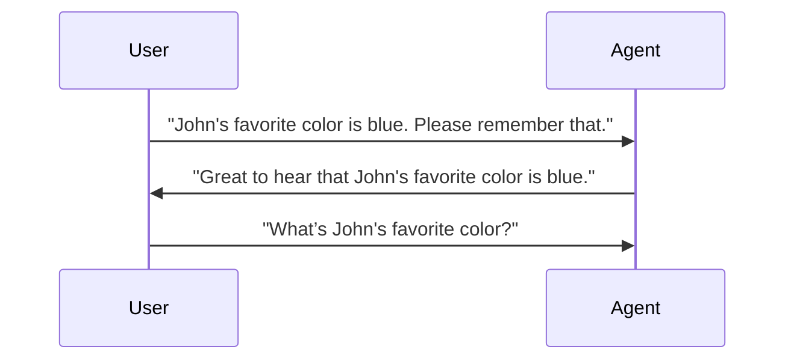

# 멀티턴 대화

Ailoy의 `Agent`는 설계상 상태 비저장(stateless)입니다. 대화 기록을 추적하지
않습니다. 에이전트를 호출할 때마다 제공된 메시지를 과거 대화에 대한 내부 메모리
없이 새로운 요청으로 처리합니다.

이전 컨텍스트와 함께 에이전트를 실행하려면 호출 시 **전체 대화 기록**(모든 이전
메시지)을 명시적으로 포함해야 합니다.

## 대화에 컨텍스트 추가하기

사용자와 에이전트가 다음 다이어그램과 같이 몇 가지 메시지를 교환했다고 가정해
봅시다.



컨텍스트를 고려하면 에이전트가 `파란색`이라고 답할 것으로 예상할 수 있습니다.

대화에 컨텍스트를 추가하려면 **이전 메시지**와 **새 사용자 메시지** 둘 다
전달해야 합니다.

{/* prettier-ignore-start */}

<CodeTabs>

```python
import asyncio

import ailoy as ai


async def main():
    lm = await ai.LangModel.new_local("Qwen/Qwen3-0.6B")
    agent = ai.Agent(lm)

    messages = [
        # the previous messages
        ai.Message(role="user", contents="John's favorite color is blue. Please remember that."),
        ai.Message(role="assistant", contents="Great to hear that John's favorite color is blue."),
        # your new user message
        ai.Message(role="user", contents="What’s John's favorite color?"),
    ]
    async for resp in agent.run(messages):
        if isinstance(resp.message.contents[0], ai.Part.Text):
            print(resp.message.contents[0].text)

if __name__ == "__main__":
    asyncio.run(main())
```

```typescript
import * as ai from "ailoy-node";

async function main() {
  const model = await ai.LangModel.newLocal("Qwen/Qwen3-0.6B");
  const agent = new ai.Agent(model);

  const messages = [
    // the previous messages
    { role: "user", contents: "John's favorite color is blue. Please remember that." },
    { role: "assistant", contents: "Great to hear that John's favorite color is blue." },
    // your new user message
    { role: "user", contents: "What’s John's favorite color?" },
  ];
  for await (const resp of agent.run(messages)) {
    if (resp.message.contents?.[0]?.type === "text")
      console.log(resp.message.contents?.[0]?.text);
  }
}

main().catch((err) => {
  console.error("Error:", err);
});
```

```typescript web
import * as ai from "ailoy-web";

async function main() {
  const model = await ai.LangModel.newLocal("Qwen/Qwen3-0.6B");
  const agent = new ai.Agent(model);

  const messages = [
    // the previous messages
    { role: "user", contents: "John's favorite color is blue. Please remember that." },
    { role: "assistant", contents: "Great to hear that John's favorite color is blue." },
    // your new user message
    { role: "user", contents: "What’s John's favorite color?" },
  ];
  for await (const resp of agent.run(messages)) {
    if (resp.message.contents?.[0]?.type === "text")
      console.log(resp.message.contents?.[0]?.text);
  }
}

main().catch((err) => {
  console.error("Error:", err);
});
```

</CodeTabs>

{/* prettier-ignore-end */}

전체 기록을 포함함으로써 Ailoy는 내부적으로 상태 비저장을 유지하면서 일관된
응답을 생성할 수 있습니다 — 실행 간에 대화 데이터를 저장하지 않습니다.

## 실시간 멀티턴 대화

실시간 메시지를 수집하고 에이전트에 다시 전달하여 사용자와 에이전트 간의 실시간
채팅을 구현할 수 있습니다.

{/* prettier-ignore-start */}

<CodeTabs>

```python
import asyncio

import ailoy as ai


async def main():
    lm = await ai.LangModel.new_local("Qwen/Qwen3-0.6B")
    agent = ai.Agent(lm)

    print("(Enter 'exit' to end the conversation.)")
    messages = []
    while (user_message := input("User: ").strip()).lower() != "exit":
        messages.append(ai.Message(role="user", contents=user_message))
        async for resp in agent.run(messages):
            if isinstance(resp.message.contents[0], ai.Part.Text):
                print("Agent:", resp.message.contents[0].text)
            messages.append(resp.message)
    print("Agent: It was a nice conversation!")


if __name__ == "__main__":
    asyncio.run(main())
```

```typescript
import * as ai from "ailoy-node";
import * as readline from "readline";

async function main() {
  const model = await ai.LangModel.newLocal("Qwen/Qwen3-0.6B");
  const agent = new ai.Agent(model);
  const rl = readline.createInterface({
    input: process.stdin,
    output: process.stdout,
  });

  const question = (msg: string) =>
    new Promise<string>((res) => rl.question(msg, res));
  let messages: ai.Messages = [];

  console.log("(Enter 'exit' to end the conversation.)");

  while (true) {
    const input = (await question("User: ")).trim();
    if (input.toLowerCase() === "exit") break;

    messages.push({ role: "user", contents: input });

    for await (const resp of agent.run(messages as ai.Messages)) {
      if (resp.message.contents?.[0]?.type === "text")
        console.log("Agent:", resp.message.contents?.[0]?.text);
      messages.push(resp.message);
    }
  }

  console.log("Agent: It was a nice conversation!");
  rl.close();
}

main().catch((err) => {
  console.error("Error:", err);
});
```

</CodeTabs>

:::info
웹 환경용 예제 코드는 여기에 제공되지 않습니다.
사용자와 지속적으로 상호작용하는 대화형 에이전트를 보려면 [**WebAssembly 지원**](webassembly-supports) 페이지를 확인하세요.
:::

{/* prettier-ignore-end */}
